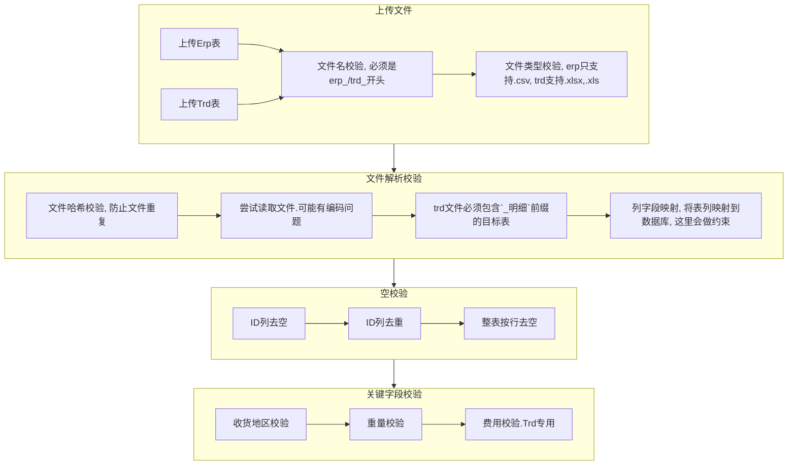

# dev design

[toc]

## 工作流设计

## 数据库的选择

对数据库选择的倾向：mongodb --> mysql --> sqlite3

【2021年12月28日】我是觉得，应该用`sqlite3`，也是今天才意识到的。
  
ref:

- [javascript - Electron app with database - Stack Overflow](https://stackoverflow.com/questions/51119248/electron-app-with-database/51119689)

## 数据库的表设计

数据库的设计里，我初步是想基于"年-月"设计表的，但这样的话，对于用户上传的表，就要逐一进行时间提取并标记然后分类，效率势必非常之慢，所以不可行。

为了支持用户高速批量导入，应该将用户所提交的表视为无状态的表，比较合适的是，按照快递公司进行分类导入，不过这对用户可能不太友好，毕竟有30多家公司……

那回到之前的方案，如果是按月导入，程序不去核对月份，而按照用户对表的约定进行数据库分类，这样是否可行呢？也许这是一个不错的方案，但这对用户的要求太高了，目前用户导出的erp表的表名与内容还有对不上的，比如ljx导的表名是12月14日的表，但里面的内容其实是11月份的，这让程序或者用户进行表主体月份划定，就存在较大的误判可能。

如果什么都不做呢？直接塞表，不去计算月份，也不按月份进行表划分，也不按快递公司进行表划分，这样的话最大的问题就是表的体积越来越大，后续匹配的速度可能就会越来越慢了。毕竟也没人可以与愿意对后续的表进行维护与调优。

综合考虑的话，那还是在数据插入时，程序计算，然后自动分类到按月划分的表里，这样插入虽然慢一些，但是好歹匹配起来会比较快，而且也不太需要考虑后续维护的问题，毕竟每个月的数据量再怎么样也是可以接受的，后续匹配的效率也可以得到保障。

## [DEPRECIATED] Module Design

- Import Panel
- Analysis Panel
- ReviseInAnalysis Panel
- Upload Panel
- Comparison Panel
- Database Panel
- Feedback Panel
