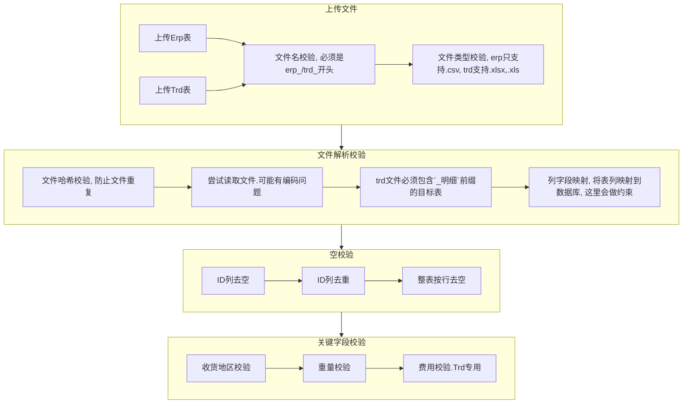

# `hjxh_express_match`

1. [Diary](#diary)
    1. [2022-01-13](#2022-01-13)
    2. [2022-01-10](#2022-01-10)
    3. [2022-01-09](#2022-01-09)
    4. [2022-01-07](#2022-01-07)
    5. [2022-01-06](#2022-01-06)
    6. [2022-01-05](#2022-01-05)
    7. [2022-01-04](#2022-01-04)
    8. [2022-01-03](#2022-01-03)
    9. [2022-01-02](#2022-01-02)
    10. [2022-01-01](#2022-01-01)
    11. [2021-12-30](#2021-12-30)
    12. [2021-12-29](#2021-12-29)
    13. [2021-12-28](#2021-12-28)
    14. [2021-12-26](#2021-12-26)
    15. [2021-12-24](#2021-12-24)
2. [Todo](#todo)
    1. [TODO: channel split of erp and trd, otherwise would go into a mess](#todo-channel-split-of-erp-and-trd-otherwise-would-go-into-a-mess)
    2. [TODO: Redux](#todo-redux)
    3. [TODO: 本地持久化](#todo-本地持久化)
    4. [TODO： 实现TRD与ERP的对比](#todo-实现trd与erp的对比)
    5. [IMPROVE: update electron title based on version number](#improve-update-electron-title-based-on-version-number)
3. [Finished/Bugfix](#finishedbugfix)
    1. [:white_check_mark: uploading trd would also have erp](#white_check_mark-uploading-trd-would-also-have-erp)
    2. [:white_check_mark: when parsing file, the focus won't be broke even switching tabs](#white_check_mark-when-parsing-file-the-focus-wont-be-broke-even-switching-tabs)
    3. [:white_check_mark: 实现TRD的数据读取与存储](#white_check_mark-实现trd的数据读取与存储)
    4. [[PASS] add log module. updated 2022-01-10.](#pass-add-log-module-updated-2022-01-10)
    5. [:white_check_mark： 实现`better-sqlite3`的表定义与封装](#white_check_mark-实现better-sqlite3的表定义与封装)
    6. [:white_check_mark: db init with `generate table in source code` or via `.env`.](#white_check_mark-db-init-with-generate-table-in-source-code-or-via-env)
    7. [:white_check_mark: change `asar: false`. 2022-01-03 tried this option, but does no help to out project, except let me more clear about what there are in the archive.](#white_check_mark-change-asar-false-2022-01-03-tried-this-option-but-does-no-help-to-out-project-except-let-me-more-clear-about-what-there-are-in-the-archive)
    8. [:white_check_mark: add electron menu. 2022-01-02](#white_check_mark-add-electron-menu-2022-01-02)
    9. [:white_circle: replace the progress stream, since it doesn't synchronize with the database, and not accurate for percentage measure。2022-01-02 19:49:20。](#white_circle-replace-the-progress-stream-since-it-doesnt-synchronize-with-the-database-and-not-accurate-for-percentage-measure2022-01-02-194920)
    10. [:white_check_mark: add the global settings json file, so that the frontend and the backend can mutually use it。2022-01-02 17:04:24](#white_check_mark-add-the-global-settings-json-file-so-that-the-frontend-and-the-backend-can-mutually-use-it2022-01-02-170424)
    11. [:white_check_mark: 省份匹配。2022-01-02，用之前的程序改成js版即可](#white_check_mark-省份匹配2022-01-02用之前的程序改成js版即可)
    12. [:white_check_mark: 测试ERP的数据读取与存储。1-1: finished](#white_check_mark-测试erp的数据读取与存储1-1-finished)
    13. [:white_check_mark: 优化文件读取过程中的前端界面展示。12-31: finished](#white_check_mark-优化文件读取过程中的前端界面展示12-31-finished)
    14. [:white_check_mark: TS2339: Property 'erp' does not exist on type 'PrismaClient '. 12-28: The solution is to use `npx prisma generate`](#white_check_mark-ts2339-property-erp-does-not-exist-on-type-prismaclient--12-28-the-solution-is-to-use-npx-prisma-generate)
    15. [:white_check_mark: 解析数据有误问题](#white_check_mark-解析数据有误问题)
    16. [:white_check_mark: `sqlite3、typeorm` native dependency](#white_check_mark-sqlite3typeorm-native-dependency)
    17. [:white_check_mark: 学习`prisma`的连接与插入业务流设计范式。](#white_check_mark-学习prisma的连接与插入业务流设计范式)
    18. [:white_check_mark: csv只读取第一行](#white_check_mark-csv只读取第一行)
    19. [:white_check_mark: 寻求`fast-csv` skip error的方案。](#white_check_mark-寻求fast-csv-skip-error的方案)
    20. [:white_check_mark: 支持上传的文件的 Sample 备份预览（包含head与tail五行）。](#white_check_mark-支持上传的文件的-sample-备份预览包含head与tail五行)
    21. [:white_check_mark: 完成数据库、前端、后端的基本设计。2021年12月22日](#white_check_mark-完成数据库前端后端的基本设计2021年12月22日)
    22. [:white_check_mark: no-headers pass but headers not](#white_check_mark-no-headers-pass-but-headers-not)
    23. [:white_check_mark: `progress-stream` cause bug](#white_check_mark-progress-stream-cause-bug)
    24. [:white_check_mark: `try...catch...finally` problem](#white_check_mark-trycatchfinally-problem)
    25. [:white_check_mark: ipcRenderer duplicate response](#white_check_mark-ipcrenderer-duplicate-response)
    26. [:white_check_mark: how to asynchronously and partially read csv](#white_check_mark-how-to-asynchronously-and-partially-read-csv)
    27. [:white_check_mark: which to choose: `node-csv` or `fast-csv`](#white_check_mark-which-to-choose-node-csv-or-fast-csv)
    28. [:white_check_mark: axios `form-data` parse bug](#white_check_mark-axios-form-data-parse-bug)
4. [业务问题](#业务问题)
    1. [:white_check_mark: ERP表中，计算价格错误](#white_check_mark-erp表中计算价格错误)
    2. [:white_check_mark: 第三方表匹配不上ERP表](#white_check_mark-第三方表匹配不上erp表)
    3. [:white_check_mark: 第三方报表格式](#white_check_mark-第三方报表格式)
    4. [:white_check_mark: 第三方表字段含义](#white_check_mark-第三方表字段含义)
5. [设计](#设计)
    1. [工作流设计](#工作流设计)
    2. [数据库的选择](#数据库的选择)
    3. [数据库的表设计](#数据库的表设计)
    4. [[DEPRECIATED] Module Design](#depreciated-module-design)
6. [Philosophy](#philosophy)
    1. [Eslint is good](#eslint-is-good)
    2. [Modularization helps me done right](#modularization-helps-me-done-right)
    3. [Interface helps me done right!](#interface-helps-me-done-right)
    4. [Interface 和 Object 之间的关系](#interface-和-object-之间的关系)
    5. [Error类的继承设计](#error类的继承设计)
7. [Experience](#experience)
    1. [IMPROVE: 关于首行检测算法+英文抬头导致第二类错误发生](#improve-关于首行检测算法英文抬头导致第二类错误发生)
    2. [忍痛隔离 `parseFileWithoutHeader` 接口，2022年01月08日](#忍痛隔离-parsefilewithoutheader-接口2022年01月08日)
    3. [Do not use global electron](#do-not-use-global-electron)
    4. [I can only use Sqlite3 for one connection](#i-can-only-use-sqlite3-for-one-connection)
8. [[ARCHIVE] 表约定【重要】](#archive-表约定重要)
    1. [术语定义](#术语定义)
    2. [通用表约定](#通用表约定)
    3. [erp表约定](#erp表约定)
    4. [trd表约定](#trd表约定)
    5. [列字段约束](#列字段约束)

## Diary

### 2022-01-13

- 修复了windows路径拼接问题（windows不支持冒号文件名）
- 修复了无法导表的问题，原因是数据库定义与旧的数据库冲突，删掉旧的数据库即可

### 2022-01-10

- 基于erp，实现了trd的读取与存储
- 修复trd表后台没有配置的问题

### 2022-01-09

- ⭐️精简了解析文件的返回结构，程序的可维护性大大提高
- 实现并测试了数据库插入与更新两种模式
- 重新调整了界面UI，将简介页分离，相应地调整了主体布局
- 实现了不加redux的跨组件分享 （TODO: 考虑是否有必要改用Redux）

### 2022-01-07

- 实现了erp的表导入，性能很ok

### 2022-01-06

- 解决了windows平台没有上传文件选项的问题
- 增加了条目汇总输出特性
- 部分修复了日记的问题……

### 2022-01-05

- 测试了windows平台的输出，通过运行
- 确定放弃了prisma的使用

### 2022-01-04

- ⭐️⭐️终于弄明白了`prisma`的bug所在，mac平台上的打包无压力（但还有改进空间）

### 2022-01-03

- ⭐️ 理解并实现了数据库自定义修改存储位置的方法
- 解决了打包后程序运行超时、数据库连接不上等问题

### 2022-01-02

- ⭐️增加了文件上传与解析的计时统计，并自主实现替换了原先的第三方依赖
- ⭐️增加了系统全局设置，允许前端修改后端的配置
- 增加了数据更新接口，并解决数据库插入timeout的问题
- ⭐️⭐️实现了前后端的接口统一，项目完全模块化、接口化！

### 2022-01-01

- 实现了文件读取的分类统计，与数据库的错误检测，至此对文件、数据库的控制基本全部完成

### 2021-12-30

- ⭐️升级了程序的整体结构，奠定了前后端通信范式，整个项目开始规范化、模块化
- 终于找到了csv读取quote异常导致中断的解决方案
- 实现了对csv读取的再一次抽象封装

### 2021-12-29

完成了数据库ORM的选型工作，确定使用`Prisma`

### 2021-12-28

前端UI基本成型

### 2021-12-26

深入理解并实现了markdown的自定义解析

### 2021-12-24

完成了系统前端与业务流的重构

## Todo

### TODO: channel split of erp and trd, otherwise would go into a mess

### TODO: Redux

### TODO: 本地持久化


### TODO： 实现TRD与ERP的对比

### IMPROVE: update electron title based on version number

I checked a few of articles, and to find there is no unified answer.

~~Maybe, the best idea and can-be-controlled approach is to update title at the same time when updating the version number in package.json, and I am to do this.~~

Oh no, since the final title rendered in the frontend, is first initialized in BrowserWindow in main.js, and then be updated by the renderer template. However, the template is fixed, not directly from the package.json in release app dir.

So, I have no idea now to change the title of template based on the package.json, unless doing some sophisticated handles.

ref:

- [node.js - How can I use variables in package.json? - Stack Overflow](https://stackoverflow.com/questions/43705195/how-can-i-use-variables-in-package-json)

- [How do I change the name of the electron window? · Issue #2543 · electron/electron](https://github.com/electron/electron/issues/2543)

- [Is there a way to get the app Version from package.json? · Issue #6451 · electron/electron](https://github.com/electron/electron/issues/6451)

## Finished/Bugfix

### :white_check_mark: uploading trd would also have erp

It's version problem, and now it has gone along with the version update.

### :white_check_mark: when parsing file, the focus won't be broke even switching tabs

update 2022-01-10 20:00:43: it's the typical problem of old state.

And the easiest solution is to use `react-usestateref`

```ts
import useState from 'react-usestateref';

const [count, setCount, counterRef] = useState(0);

console.log(couterRef.current); // it will always have the latest state value
setCount(20);
console.log(counterRef.current);
```

ref:

- [javascript - React hooks: accessing up-to-date state from within a callback - Stack Overflow](https://stackoverflow.com/questions/57847594/react-hooks-accessing-up-to-date-state-from-within-a-callback)

### :white_check_mark: 实现TRD的数据读取与存储

### [PASS] add log module. updated 2022-01-10.

### :white_check_mark： 实现`better-sqlite3`的表定义与封装

  

### :white_check_mark: db init with `generate table in source code` or via `.env`.

2022-01-04，it's very successful and valuable to finally solve this problem!

### :white_check_mark: change `asar: false`. 2022-01-03 tried this option, but does no help to out project, except let me more clear about what there are in the archive.

### :white_check_mark: add electron menu. 2022-01-02

### :white_circle: replace the progress stream, since it doesn't synchronize with the database, and not accurate for percentage measure。2022-01-02 19:49:20。

I have done some research on how to do the `pipe` on node stream, and learned a lot.

In fact, I first browsed node.js documentation, but in a loss.

Then I dived into the source code of the package I am using: `progress-stream`, and realized he used the dependent
package of `through2`.

Then I followed the github of `through2`, which gave me the following valuable instruction:

  


Hence, based on my knowledge, I diy one for simplicity without any third package.

```ts
import { Transform } from 'stream';

import { round } from '../../../../universal';

export class SizeTransformer extends Transform {
  private hasRead = 0;

  private readonly size;

  private readonly f;

  constructor(size, f: (size: number) => void) {
    super();
    this.size = size;
    this.f = f;
  }

  _transform(chunk, _, callback) {
    // @ts-ignore
    this.push(chunk);
    this.hasRead += chunk.length;
    const pct = round(this.hasRead / this.size, 3);
    this.f(pct);
    callback();
  }
}
```

And also, I came up with the idea of using two percentage calculator, one for read file size, one for saved rows.

Afterwards, I realized the final ideal effect, which is accurate and lovely -- two circular progresses:

  

Thanks for all !

ref:

- [stream 流 | Node.js API 文档](http://nodejs.cn/api/stream.html#class-streamwritable)


- [API 文档 - Node.js 中文网](http://api.nodejs.cn/)

- [rvagg/through2: Tiny wrapper around Node streams2 Transform to avoid explicit subclassing noise](https://github.com/rvagg/through2)

- [through2原理解析 - SegmentFault 思否](https://segmentfault.com/a/1190000011740894)

### :white_check_mark: add the global settings json file, so that the frontend and the backend can mutually use it。2022-01-02 17:04:24

### :white_check_mark: 省份匹配。2022-01-02，用之前的程序改成js版即可

### :white_check_mark: 测试ERP的数据读取与存储。1-1: finished

### :white_check_mark: 优化文件读取过程中的前端界面展示。12-31: finished

### :white_check_mark: TS2339: Property 'erp' does not exist on type 'PrismaClient '. 12-28: The solution is to use `npx prisma generate`

### :white_check_mark: 解析数据有误问题

  

webstorm csv


wps csv


sublime csv


:heart: attempt to save to wps [update: 不愧是我]


This solution is rather robust, and does solve my problem, which achieves a balance between server code and user
experience!

What a genius I am that a flash of inspiration occurred to my mind which suggested me to give 're-saving' a shot :
heavy_exclamation_mark:

  

### :white_check_mark: `sqlite3、typeorm` native dependency

2021-12-30 update：there is no need to think about `typeorm` any longer since I have decided to use `prisma` which works
well.

安装`sqlite3, typeorm`之后没法运行`electron`了


ref:

- [What is exactly native dependency? · Issue #1042 · electron-react-boilerplate/electron-react-boilerplate](https://github.com/electron-react-boilerplate/electron-react-boilerplate/issues/1042)

### :white_check_mark: 学习`prisma`的连接与插入业务流设计范式。

方案：`prisma`
会在第一次query时自动连接数据库，拥有一个数据库连接池，所以无需我自己管理。ref: [Connecting and disconnecting (Concepts) | Prisma Docs](https://www.prisma.io/docs/concepts/components/prisma-client/working-with-prismaclient/connection-management)

### :white_check_mark: csv只读取第一行

方案：在`fast-csv`的第一个回调里处理就可以，这里就是第一行；如果不是行的话，可以用`fs`的`start | end`参数控制。

### :white_check_mark: 寻求`fast-csv` skip error的方案。

结果：官方回复：[Skip row at on('error') event ](https://github.com/C2FO/fast-csv/issues/179#:~:text=No%2C%20if%20an%20error%20is%20encountered%20it%20is%20usually%20because%20the%20parser%20is%20unsure%20how%20to%20proceed%20with%20the%20file%2C%20and%20can%20lead%20to%20very%20unpredictable%20results.)

  

### :white_check_mark: 支持上传的文件的 Sample 备份预览（包含head与tail五行）。

这是之前的方案，目前已经不采用，目前不存在0/1的问题，即不是按文件为基本单位传输给用户，而是在读取过程中持续地按行为基本单位（可选：筛选出有问题的部分）传输给用户，因此备份预览没有意义也不需要了。

### :white_check_mark: 完成数据库、前端、后端的基本设计。2021年12月22日

### :white_check_mark: no-headers pass but headers not

The reason is that I wrote condition of `_id === null` with always return `true` since the default 'error result'
is `""`, an empty string not `null`.

So, I remedied it by changing the condition to `!_id` which can detect not only `null` but also 'empty'. And then I
fixed this bug.

  

### :white_check_mark: `progress-stream` cause bug

2021年12月29日04:47:04，在引入`progress-stream`包后导致了`csv`解析的错误，后来测试发现，只要把`progress-stream`放在`fast-csv`
之前就行了。想来也是，毕竟`progress-stream`是处理`stream`的，而`csv`那一步已经变成`row`了，具体细节我也不明白也不是很重要，这里会用就行了。


- [freeall/progress-stream: Read the progress of a stream](https://github.com/freeall/progress-stream)
- [progress-stream - npm](https://www.npmjs.com/package/progress-stream)
- [node.js - streams with percentage complete - Stack Overflow](https://stackoverflow.com/questions/17798047/streams-with-percentage-complete)

### :white_check_mark: `try...catch...finally` problem

:white_check_mark: 2021年12月29日03:40:04，`try...catch`结构中，`finally`为什么会提前结束？事实上这个问题是我对js中的`try...catch...finally`
理解不够深刻，还拿着`python`中的同步思维去理解的。js里的这套结构体远比我想象地复杂，但是呢，为了避免这种复杂（在`try`或者`catch`中各种乱返回），一种好的办法就是只在`finally`
里返回（当然，这点我是知道的，只不过没有把它当做信仰）。

更新：我后续在那块代码中修改了写法，剔除了`try...catch...`，所以`finally`的问题也就不存在了。

启示：尽量不要在异步程序中使用`t...c...f`，否则可要小心了。

- [Finally in Promises & Try/Catch - DEV Community](https://dev.to/annarankin/finally-in-promises--trycatch-2c44)
- [javascript - Why does a return in `finally` override `try`? - Stack Overflow](https://stackoverflow.com/questions/3837994/why-does-a-return-in-finally-override-try)

### :white_check_mark: ipcRenderer duplicate response

2021年12月29日01:03:02，ipc通信中前端逐步累积渲染问题，猜测原因，可能是1. `ipcRenderer`中的端口使用`on`导致重复监听，并且最后的`removeAllListeners`方法没有生效；2.`react`
问题。貌似重新启动一下`electron`就好了……

  

更新：实际上这个问题，是由`try...catch...finally`使用不当导致的，和`electron`、`react`都没关系，它们的部分都是正常的，`electron`的`listener`
监听部分失效，但是重新启动一下它也正常了。关于`t...c...f`问题见[:white_check_mark: `try...catch...finally` problem](#--x-trycatchfinally-problem)

### :white_check_mark: how to asynchronously and partially read csv

csv异步、小量快读读取.csv文件头部信息，以确定编码。已实现，基于`fast-csv`解决了中文乱码导致`node-csv`无法读取的问题，同时基于`iconv`实现了`gbk`与`utf-8`之间的无缝转换

### :white_check_mark: which to choose: `node-csv` or `fast-csv`

csv文件读取的选型与方法。经过鉴定，`node-csv`的接口比较低级，`fast-csv`更高些，并且更加稳健，输出方式（可以设置headers有或者无）比较友好，所以选择`fast-csv`。在读取上，有`fs.read`
，`fs.readFile`，`fs.createReadStream`等几种方式，经过比较，`fs.read`接口比较低级，速度快，适合用于编码测试；等测试完后使用`fs.createReadStream`
处理流数据比较好，方便与`iconv`、`fast-csv`等配合。

### :white_check_mark: axios `form-data` parse bug

本地前端上传文件`options`信息：


远程前端上传文件`options`信息：


这是在前端进行文件上传的断点调试


基于这个，再进行服务端文件调试，比对文件信息的不同。但是现在的问题是服务端进入不了程序逻辑，直接被fastapi拒绝了。

## 业务问题

### :white_check_mark: ERP表中，计算价格错误

目前已发现的主要有两种错误：

1. 收货地区填写不规范（6/50+w），导致未能正确识别省份名称，例如：
   

    更新：对于这种问题，直接提示报错即可。

2. 重量为0（这个还比较多，146/50+w），无法理解,例如：
   

更新：对于这个问题，一开始是某张表给的问题，后续小范围问题可以直接报错提示。

### :white_check_mark: 第三方表匹配不上ERP表

更新：初期是因为发现有很多表的id导出是`=`开头的，后期加了稳健的检测与转换，这个问题就基本没了。

### :white_check_mark: 第三方报表格式

注意到发来的第三方对账单，例如："11月第三方仓韵达"是Excel格式，且包含着"订单明细wms"表与"快递核算标准"表，请问这个应该属于"惯例"吧？ anyway，这个倒不是啥问题哈，个人可以接受。

更新：这个问题其实不重要，因为有一个专门的快递核算大表，可以根据那个进行运费计算。

### :white_check_mark: 第三方表字段含义

  

1. 发货订单号 和 快递单号 之间的区别？该选用哪个？
2. 涨价金额 是不是无关紧要？

更新：目前直接规定死字段。

## 设计

### 工作流设计



### 数据库的选择

对数据库选择的倾向：mongodb --> mysql --> sqlite3

【2021年12月28日】我是觉得，应该用`sqlite3`，也是今天才意识到的。
  
ref:

- [javascript - Electron app with database - Stack Overflow](https://stackoverflow.com/questions/51119248/electron-app-with-database/51119689)

### 数据库的表设计

数据库的设计里，我初步是想基于"年-月"设计表的，但这样的话，对于用户上传的表，就要逐一进行时间提取并标记然后分类，效率势必非常之慢，所以不可行。

为了支持用户高速批量导入，应该将用户所提交的表视为无状态的表，比较合适的是，按照快递公司进行分类导入，不过这对用户可能不太友好，毕竟有30多家公司……

那回到之前的方案，如果是按月导入，程序不去核对月份，而按照用户对表的约定进行数据库分类，这样是否可行呢？也许这是一个不错的方案，但这对用户的要求太高了，目前用户导出的erp表的表名与内容还有对不上的，比如ljx导的表名是12月14日的表，但里面的内容其实是11月份的，这让程序或者用户进行表主体月份划定，就存在较大的误判可能。

如果什么都不做呢？直接塞表，不去计算月份，也不按月份进行表划分，也不按快递公司进行表划分，这样的话最大的问题就是表的体积越来越大，后续匹配的速度可能就会越来越慢了。毕竟也没人可以与愿意对后续的表进行维护与调优。

综合考虑的话，那还是在数据插入时，程序计算，然后自动分类到按月划分的表里，这样插入虽然慢一些，但是好歹匹配起来会比较快，而且也不太需要考虑后续维护的问题，毕竟每个月的数据量再怎么样也是可以接受的，后续匹配的效率也可以得到保障。

### [DEPRECIATED] Module Design

- Import Panel
- Analysis Panel
- ReviseInAnalysis Panel
- Upload Panel
- Comparison Panel
- Database Panel
- Feedback Panel

## Philosophy

### Eslint is good

If you want to improve your coding ability, especially the coding quality, the most recommend way is to read `eslint`.

ref:

- [no-plusplus - Rules - ESLint - Pluggable JavaScript linter](https://eslint.org/docs/rules/no-plusplus)

### Modularization helps me done right

After hours of module composition, I'm happy to find my design error.

Modularization yyds!


### Interface helps me done right!

  

### Interface 和 Object 之间的关系

如图，在我花了漫长的时间终于设计出一个目前接口比较良好的`handleParseFile`的函数之后，为了暴露给前端，我需要写一个接口。

  

这个时候，问题来了，我当然可以直接用`ReturnType`自动追踪这个函数的参数与返回类型……

OH NO！

写着写着我发现我想错了，我虽然可以从函数自动得到它的返回类型，但我貌似是没法得到这个函数的参数类型的吧（待确定）！

你看，写笔记还是有帮助的，不写还不知道自己的认知其实是错的呢！

这就先去查一查，是否可以将接口自动同步于某个函数，或者说，是否可以从函数生成接口。

  


确实不行！都没有相关问题！

老老实实写接口吧！（原以为是先有鸡再有蛋的问题呢！结果ts直接把“蛋生鸡”路给封了！）

  

### Error类的继承设计

很有意思的一点，就是在整合优化代码时，发现整合到了Error类的冗余定义。

再仔细想想`eslint`对每个文件只能有一个`class`导出的约定，还挺有意思的，把类拆开，代码变得更加好组织了。

  

所以接下来就是把所有用这个类的代码都消掉了。

  

OK，很快就消除完了，毕竟我后续定义的`MyError`类是这个`TestCsv...`类的超集。

  

## Experience

### IMPROVE: 关于首行检测算法+英文抬头导致第二类错误发生

所谓第二类错误就是取假错误，明明是错的，却认为是对的。

为提升系统系统，加入了首行检测算法，并为了程序的可读性，规定用户输入为英文抬头。

结果由于英文的通用性，既可以被`utf-8`识别，也可以被`gbk`识别，导致单单考首行检测目标字段（也就是抬头）是否存在无法区分编码信息。

导致可能是gbk编码的文件在utf-8的检测中被错误通过，错误认为是utf-8格式。

为此，有两种解决方案。

1. 将抬头部分或全部改成中文，这样抬头就包含了编码信息，可以准确地识别出utf-8或是gbk。目前采用的是这个办法，程序端改的代码量少，实现简单，客户端要把列名“id”改成“单号”。
2. 实现一段智能中文检测算法，但这个难度较大，性能也势必较低，因为它不是一个确定文字是不是中文的问题，而是确定一块buffer是不是中文，以及是不是特定中文编码的问题。

具体见下图：
  

以及相关参考链接： [c# - How can I detect the encoding/codepage of a text file - Stack Overflow](https://stackoverflow.com/questions/90838/how-can-i-detect-the-encoding-codepage-of-a-text-file)

  

文中提到，我可以猜，是的，我可以猜，那在我们目前这个实现上没有必要。

### 忍痛隔离 `parseFileWithoutHeader` 接口，2022年01月08日

  

### Do not use global electron

These days,

### I can only use Sqlite3 for one connection

Developers of `prisma` are devoted to work, and I learned a lot from their github issue.

And I am surprised to find that I can only use one connection limit in order not to cause timeout.

  

ref:

- [Support setting a timeout for SQLite · Issue #2955 · prisma/prisma](https://github.com/prisma/prisma/issues/2955)

## [ARCHIVE] 表约定【重要】

该章节的全部内容均已经更新，并且独立成单独的文件，方便用于前端展示，已不在总文档内更新，具体可以见：

- [upload_base](./erb/src/docs/upload_base.md)
- [upload_erp](./erb/src/docs/upload_erp.md)
- [upload_trd](./erb/src/docs/upload_trd.md)

### 术语定义

- erp表：erp数据由erp系统导出，以`.csv`文件形式，内部只会有一张表，该文件即该表即erp表即erp的明细表
- trd表：trd数据由各物流公司给出，以`.xlsx|.xls`文件形式，内部可能会有多张表，其中包含物流明细信息的表叫明细表，该明细表即trd表

### 通用表约定

对于任意一张明细表，尽管即使表的内容存在一定的不规范也不影响解析，但总体来说，表的质量也有优劣之分，以下将给出详细的参照，在系统读表的过程中如果出现问题可以对照该参照，一定程度上可以找到问题的所在。

1. 明细表的第一行，**必须**是列字段，不得出现第一行为空、为非相关信息等，否则将出错
2. 明细表的数据主体**必须**是一个完整的矩形，即列与列之间不得空列、行与行之间不得有空行，否则将导致数据解析丢失
3. 明细表的数据主体之后，允许有多余的其他汇总信息，但是，这可能导致最终解析错误，建议不要加汇总信息，或者至少隔一行。如果您们使用excle自带的统计汇总功能，请剪切最后一行然后粘贴到`第N+2行`
   或以后；如果直接用右键插入一行空行，实际上程序依旧会把它们识别成一起，最终导致错误。
4. 基于以上格式规范的表，是一张较为完美的表。

### erp表约定

1. erp表**必须**以`.csv`格式导出，并且加上`erp_`前缀，否则无法解析
2. erp表中**必须**包含以下列字段：
    1. 物流单号 --> _id
    2. 收货地区 --> area_erp
    3. 实际重量 --> weight_erp
    4. 发货时间 --> time_erp
    5. 物流公司 --> logistics_erp

### trd表约定

1. trd表**必须**以`.xlsx | .xls`格式导出，并且加上`trd_`前缀，否则无法解析
2. trd表中**必须**有一张明细表，该明细表必须有`_明细`前缀，用于程序识别
3. trd的明细表**必须**新建一列`_快递`，用于标识所选用的快递公司，快递公司的名字要使用该表对应的价格表中的公司抬头名，比如"铁岭中通"或者"常州韵达"
4. 目前对trd表的列字段没有像erp那样严格，我们目前的算法是循环检测是否包含目标字段，这将有误判概率，例如表中同时有"实收重量"与"重量"两列，就很可能识别成"重量"而非"实收重量"
   ，基于这些已有的问题，trd表中的列字段仍需做出一定的约束，目标表的列字段的实际命名，**必须**
   是列表中的合法元素，否则将产生错误；如果有多个元素，则目标列必须在伪目标列之前，否则将产生错误（或可定制）。一个比较稳妥的做法，就是统一使用第一个候选列名，虽然这个代价应该有点大。
    1. 快递单号： ("快递单号", "运单编号", "运单号", "运单", "单号") --> _id
    2. 省份： ("省份", "省", "目的", "收货", "到达") --> area_trd
    3. 重量： ("重量", ) --> weight_trd
    4. 发货时间： ("发货时间", "发货日期", "时间", "日期") --> time_trd
    5. 运费： ("运费", "快递费", "面单费", "费用", "总价",  "金额", "价格",) --> fee_trd

### 列字段约束

1. 快递单号 (_id)
    1. 快递单号**不得为空**
    2. 快递单号**必须**是文本，在实际操作中发现有存为数据格式，导致被excel误以为是一个大整数于是丢失了尾部的0的情况，请务必以文本形式存储，否则将全部报错
    3. 快递单号还发现有"=xxxx"格式存储的，可能是用了公式啥的，尽管已经设计了算法还原，但是尽量避免这样的问题产生
    4. 否则该行报错
2. 重量 (weight_erp, weight_trd)
    1. 所有重量**不得为空**
    2. 所有重量**必须**是一个浮点数（小数或整数）
    3. 所有重量**必须**大于0
    4. 否则该行报错
3. 省份（area_erp, area_trd)
    1. 所有省份**不得为空**
    2. 所有省份**必须**以合法的34个省市自治区的前缀开头
    3. 否则该行报错
4. 发货时间 (time_erp, time_trd)
    1. 所有时间**不得为空**
    2. 所有时间**必须**包含"YYYY.MM.DD"或"MM.DD.YYYY"字符串样式，其中"."可以是"-"或者"/"
    3. 实际解析过程中发现还有以1900年起的天数作为日期列的，即4w+的一个数，尽管我已经写了一个逆转算法，但是尽量避免这样的问题产生，这里面涉及到excel中短日期的显示问题，具体可以查一下相关资料
    4. 否则该行报错
