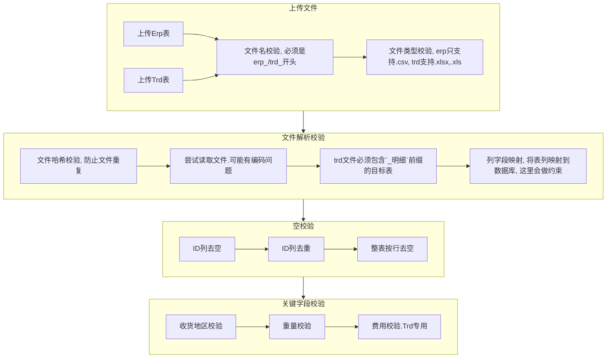

# dev design

[toc]

## 工作流设计

## 数据库的选择

对数据库选择的倾向：mongodb --> mysql --> sqlite3

【2021年12月28日】我是觉得，应该用`sqlite3`，也是今天才意识到的。
  
ref:

- [javascript - Electron app with database - Stack Overflow](https://stackoverflow.com/questions/51119248/electron-app-with-database/51119689)

## 数据库的表设计

数据库的设计里，我初步是想基于"年-月"设计表的，但这样的话，对于用户上传的表，就要逐一进行时间提取并标记然后分类，效率势必非常之慢，所以不可行。

为了支持用户高速批量导入，应该将用户所提交的表视为无状态的表，比较合适的是，按照快递公司进行分类导入，不过这对用户可能不太友好，毕竟有30多家公司……

那回到之前的方案，如果是按月导入，程序不去核对月份，而按照用户对表的约定进行数据库分类，这样是否可行呢？也许这是一个不错的方案，但这对用户的要求太高了，目前用户导出的erp表的表名与内容还有对不上的，比如ljx导的表名是12月14日的表，但里面的内容其实是11月份的，这让程序或者用户进行表主体月份划定，就存在较大的误判可能。

如果什么都不做呢？直接塞表，不去计算月份，也不按月份进行表划分，也不按快递公司进行表划分，这样的话最大的问题就是表的体积越来越大，后续匹配的速度可能就会越来越慢了。毕竟也没人可以与愿意对后续的表进行维护与调优。

综合考虑的话，那还是在数据插入时，程序计算，然后自动分类到按月划分的表里，这样插入虽然慢一些，但是好歹匹配起来会比较快，而且也不太需要考虑后续维护的问题，毕竟每个月的数据量再怎么样也是可以接受的，后续匹配的效率也可以得到保障。

## [ARCHIVE] 表约定【重要】

该章节的全部内容均已经更新，并且独立成单独的文件，方便用于前端展示，已不在总文档内更新，具体可以见：

- [upload_base](./erb/src/docs/upload_base.md)
- [upload_erp](./erb/src/docs/upload_erp.md)
- [upload_trd](./erb/src/docs/upload_trd.md)

### 术语定义

- erp表：erp数据由erp系统导出，以`.csv`文件形式，内部只会有一张表，该文件即该表即erp表即erp的明细表
- trd表：trd数据由各物流公司给出，以`.xlsx|.xls`文件形式，内部可能会有多张表，其中包含物流明细信息的表叫明细表，该明细表即trd表

### 通用表约定

对于任意一张明细表，尽管即使表的内容存在一定的不规范也不影响解析，但总体来说，表的质量也有优劣之分，以下将给出详细的参照，在系统读表的过程中如果出现问题可以对照该参照，一定程度上可以找到问题的所在。

1. 明细表的第一行，**必须**是列字段，不得出现第一行为空、为非相关信息等，否则将出错
2. 明细表的数据主体**必须**是一个完整的矩形，即列与列之间不得空列、行与行之间不得有空行，否则将导致数据解析丢失
3. 明细表的数据主体之后，允许有多余的其他汇总信息，但是，这可能导致最终解析错误，建议不要加汇总信息，或者至少隔一行。如果您们使用excle自带的统计汇总功能，请剪切最后一行然后粘贴到`第N+2行`
   或以后；如果直接用右键插入一行空行，实际上程序依旧会把它们识别成一起，最终导致错误。
4. 基于以上格式规范的表，是一张较为完美的表。

### erp表约定

1. erp表**必须**以`.csv`格式导出，并且加上`erp_`前缀，否则无法解析
2. erp表中**必须**包含以下列字段：
    1. 物流单号 --> _id
    2. 收货地区 --> area_erp
    3. 实际重量 --> weight_erp
    4. 发货时间 --> time_erp
    5. 物流公司 --> logistics_erp

### trd表约定

1. trd表**必须**以`.xlsx | .xls`格式导出，并且加上`trd_`前缀，否则无法解析
2. trd表中**必须**有一张明细表，该明细表必须有`_明细`前缀，用于程序识别
3. trd的明细表**必须**新建一列`_快递`，用于标识所选用的快递公司，快递公司的名字要使用该表对应的价格表中的公司抬头名，比如"铁岭中通"或者"常州韵达"
4. 目前对trd表的列字段没有像erp那样严格，我们目前的算法是循环检测是否包含目标字段，这将有误判概率，例如表中同时有"实收重量"与"重量"两列，就很可能识别成"重量"而非"实收重量"
   ，基于这些已有的问题，trd表中的列字段仍需做出一定的约束，目标表的列字段的实际命名，**必须**
   是列表中的合法元素，否则将产生错误；如果有多个元素，则目标列必须在伪目标列之前，否则将产生错误（或可定制）。一个比较稳妥的做法，就是统一使用第一个候选列名，虽然这个代价应该有点大。
    1. 快递单号： ("快递单号", "运单编号", "运单号", "运单", "单号") --> _id
    2. 省份： ("省份", "省", "目的", "收货", "到达") --> area_trd
    3. 重量： ("重量", ) --> weight_trd
    4. 发货时间： ("发货时间", "发货日期", "时间", "日期") --> time_trd
    5. 运费： ("运费", "快递费", "面单费", "费用", "总价",  "金额", "价格",) --> fee_trd

### 列字段约束

1. 快递单号 (_id)
    1. 快递单号**不得为空**
    2. 快递单号**必须**是文本，在实际操作中发现有存为数据格式，导致被excel误以为是一个大整数于是丢失了尾部的0的情况，请务必以文本形式存储，否则将全部报错
    3. 快递单号还发现有"=xxxx"格式存储的，可能是用了公式啥的，尽管已经设计了算法还原，但是尽量避免这样的问题产生
    4. 否则该行报错
2. 重量 (weight_erp, weight_trd)
    1. 所有重量**不得为空**
    2. 所有重量**必须**是一个浮点数（小数或整数）
    3. 所有重量**必须**大于0
    4. 否则该行报错
3. 省份（area_erp, area_trd)
    1. 所有省份**不得为空**
    2. 所有省份**必须**以合法的34个省市自治区的前缀开头
    3. 否则该行报错
4. 发货时间 (time_erp, time_trd)
    1. 所有时间**不得为空**
    2. 所有时间**必须**包含"YYYY.MM.DD"或"MM.DD.YYYY"字符串样式，其中"."可以是"-"或者"/"
    3. 实际解析过程中发现还有以1900年起的天数作为日期列的，即4w+的一个数，尽管我已经写了一个逆转算法，但是尽量避免这样的问题产生，这里面涉及到excel中短日期的显示问题，具体可以查一下相关资料
    4. 否则该行报错

## [DEPRECIATED] Module Design

- Import Panel
- Analysis Panel
- ReviseInAnalysis Panel
- Upload Panel
- Comparison Panel
- Database Panel
- Feedback Panel
