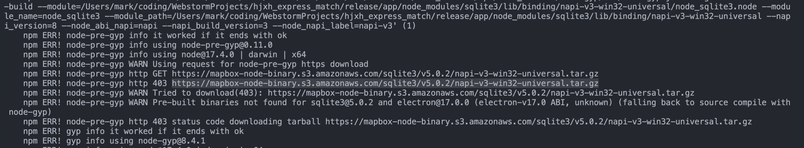

# dev notes

[toc]

## finished

### :white_check_mark:  channel split of erp and trd, otherwise would go into a mess

## experience

### IMPROVE: 关于首行检测算法+英文抬头导致第二类错误发生

所谓第二类错误就是取假错误，明明是错的，却认为是对的。

为提升系统系统，加入了首行检测算法，并为了程序的可读性，规定用户输入为英文抬头。

结果由于英文的通用性，既可以被`utf-8`识别，也可以被`gbk`识别，导致单单考首行检测目标字段（也就是抬头）是否存在无法区分编码信息。

导致可能是gbk编码的文件在utf-8的检测中被错误通过，错误认为是utf-8格式。

为此，有两种解决方案。

1. 将抬头部分或全部改成中文，这样抬头就包含了编码信息，可以准确地识别出utf-8或是gbk。目前采用的是这个办法，程序端改的代码量少，实现简单，客户端要把列名“id”改成“单号”。
2. 实现一段智能中文检测算法，但这个难度较大，性能也势必较低，因为它不是一个确定文字是不是中文的问题，而是确定一块buffer是不是中文，以及是不是特定中文编码的问题。

具体见下图：
  

以及相关参考链接： [c# - How can I detect the encoding/codepage of a text file - Stack Overflow](https://stackoverflow.com/questions/90838/how-can-i-detect-the-encoding-codepage-of-a-text-file)

  

文中提到，我可以猜，是的，我可以猜，那在我们目前这个实现上没有必要。

### 忍痛隔离 `parseFileWithoutHeader` 接口，2022年01月08日

  

### Do not use global electron

These days,

### I can only use Sqlite3 for one connection

Developers of `prisma` are devoted to work, and I learned a lot from their github issue.

And I am surprised to find that I can only use one connection limit in order not to cause timeout.

  

ref:

- [Support setting a timeout for SQLite · Issue #2955 · prisma/prisma](https://github.com/prisma/prisma/issues/2955)

## Bugfix

### FIXME: build windows version on macOS

Can't use the following config (`"arch": "universal"`) since there's no `universal` version of `sqlite3`.

```json
        "win": {
            "target": {
                "target": "portable",
                "arch": "universal"
            }
        },
```

  

If we change the url in the above from `https://mapbox-node-binary.s3.amazonaws.com/sqlite3/v5.0.2/napi-v3-win32-universal.tar.gz` to `https://mapbox-node-binary.s3.amazonaws.com/sqlite3/v5.0.2/napi-v3-win32-x64.tar.gz`.

Then the url is available (not 403).

### :white_check_mark: FIXED: download binary electron using proper mirror

```sh
ELECTRON_MIRROR=https://cdn.npm.taobao.org/dist/electron/
```

When pack using `npm run app:dist` (i.e. `electron-builder`), it shows mirror is unavailable:

  

And then I checked the shown url and after I copied the link address, it indicates `https://registry.npmmirror.com/-/binary/electron/v17.0.0/electron-v17.0.0-darwin-x64.zip` rather than `https://npm.taobao.org/mirrors/electron/17.0.0/electron-v17.0.0-darwin-x64.zip`, also not the file under the html at: `https://registry.npmmirror.com/binary.html?path=electron/v17.0.0/` 

So, maybe we should change our mirror url to be something like `https://registry.npmmirror.com`

  

However, it still shows error:

  

Then I understood it's because the `npmrc` config:

  

  

So I just uncommented it.

But it still won't help!

---

Finally, I followed the electron official documentation and successfully downloaded!

  

  

And the lesson I learned is not to believe third-party components (especially by Chinese):

  


### :white_check_mark: uploading trd would also have erp

It's version problem, and now it has gone along with the version update.

### :white_check_mark: when parsing file, the focus won't be broke even switching tabs

update 2022-01-10 20:00:43: it's the typical problem of old state.

And the easiest solution is to use `react-usestateref`

```ts
import useState from 'react-usestateref';

const [count, setCount, counterRef] = useState(0);

console.log(couterRef.current); // it will always have the latest state value
setCount(20);
console.log(counterRef.current);
```

ref:

- [javascript - React hooks: accessing up-to-date state from within a callback - Stack Overflow](https://stackoverflow.com/questions/57847594/react-hooks-accessing-up-to-date-state-from-within-a-callback)

### :white_check_mark: 实现TRD的数据读取与存储

### [PASS] add log module. updated 2022-01-10.

### :white_check_mark： 实现`better-sqlite3`的表定义与封装

  

### :white_check_mark: db init with `generate table in source code` or via `.env`.

2022-01-04，it's very successful and valuable to finally solve this problem!

### :white_check_mark: change `asar: false`. 2022-01-03 tried this option, but does no help to out project, except let me more clear about what there are in the archive.

### :white_check_mark: add electron menu. 2022-01-02

### :white_circle: replace the progress stream, since it doesn't synchronize with the database, and not accurate for percentage measure。2022-01-02 19:49:20。

I have done some research on how to do the `pipe` on node stream, and learned a lot.

In fact, I first browsed node.js documentation, but in a loss.

Then I dived into the source code of the package I am using: `progress-stream`, and realized he used the dependent
package of `through2`.

Then I followed the github of `through2`, which gave me the following valuable instruction:

  


Hence, based on my knowledge, I diy one for simplicity without any third package.

```ts
import { Transform } from 'stream';

import { round } from '../../../../universal';

export class SizeTransformer extends Transform {
  private hasRead = 0;

  private readonly size;

  private readonly f;

  constructor(size, f: (size: number) => void) {
    super();
    this.size = size;
    this.f = f;
  }

  _transform(chunk, _, callback) {
    // @ts-ignore
    this.push(chunk);
    this.hasRead += chunk.length;
    const pct = round(this.hasRead / this.size, 3);
    this.f(pct);
    callback();
  }
}
```

And also, I came up with the idea of using two percentage calculator, one for read file size, one for saved rows.

Afterwards, I realized the final ideal effect, which is accurate and lovely -- two circular progresses:

  

Thanks for all !

ref:

- [stream 流 | Node.js API 文档](http://nodejs.cn/api/stream.html#class-streamwritable)


- [API 文档 - Node.js 中文网](http://api.nodejs.cn/)

- [rvagg/through2: Tiny wrapper around Node streams2 Transform to avoid explicit subclassing noise](https://github.com/rvagg/through2)

- [through2原理解析 - SegmentFault 思否](https://segmentfault.com/a/1190000011740894)

### :white_check_mark: add the global settings json file, so that the frontend and the backend can mutually use it。2022-01-02 17:04:24

### :white_check_mark: 省份匹配。2022-01-02，用之前的程序改成js版即可

### :white_check_mark: 测试ERP的数据读取与存储。1-1: finished

### :white_check_mark: 优化文件读取过程中的前端界面展示。12-31: finished

### :white_check_mark: TS2339: Property 'erp' does not exist on type 'PrismaClient '. 12-28: The solution is to use `npx prisma generate`

### :white_check_mark: 解析数据有误问题

  

webstorm csv


wps csv


sublime csv


:heart: attempt to save to wps [update: 不愧是我]


This solution is rather robust, and does solve my problem, which achieves a balance between server code and user
experience!

What a genius I am that a flash of inspiration occurred to my mind which suggested me to give 're-saving' a shot :
heavy_exclamation_mark:

  

### :white_check_mark: `sqlite3、typeorm` native dependency

2021-12-30 update：there is no need to think about `typeorm` any longer since I have decided to use `prisma` which works
well.

安装`sqlite3, typeorm`之后没法运行`electron`了


ref:

- [What is exactly native dependency? · Issue #1042 · electron-react-boilerplate/electron-react-boilerplate](https://github.com/electron-react-boilerplate/electron-react-boilerplate/issues/1042)

### :white_check_mark: 学习`prisma`的连接与插入业务流设计范式。

方案：`prisma`
会在第一次query时自动连接数据库，拥有一个数据库连接池，所以无需我自己管理。ref: [Connecting and disconnecting (Concepts) | Prisma Docs](https://www.prisma.io/docs/concepts/components/prisma-client/working-with-prismaclient/connection-management)

### :white_check_mark: csv只读取第一行

方案：在`fast-csv`的第一个回调里处理就可以，这里就是第一行；如果不是行的话，可以用`fs`的`start | end`参数控制。

### :white_check_mark: 寻求`fast-csv` skip error的方案。

结果：官方回复：[Skip row at on('error') event ](https://github.com/C2FO/fast-csv/issues/179#:~:text=No%2C%20if%20an%20error%20is%20encountered%20it%20is%20usually%20because%20the%20parser%20is%20unsure%20how%20to%20proceed%20with%20the%20file%2C%20and%20can%20lead%20to%20very%20unpredictable%20results.)

  

### :white_check_mark: 支持上传的文件的 Sample 备份预览（包含head与tail五行）。

这是之前的方案，目前已经不采用，目前不存在0/1的问题，即不是按文件为基本单位传输给用户，而是在读取过程中持续地按行为基本单位（可选：筛选出有问题的部分）传输给用户，因此备份预览没有意义也不需要了。

### :white_check_mark: 完成数据库、前端、后端的基本设计。2021年12月22日

### :white_check_mark: no-headers pass but headers not

The reason is that I wrote condition of `_id === null` with always return `true` since the default 'error result'
is `""`, an empty string not `null`.

So, I remedied it by changing the condition to `!_id` which can detect not only `null` but also 'empty'. And then I
fixed this bug.

  

### :white_check_mark: `progress-stream` cause bug

2021年12月29日04:47:04，在引入`progress-stream`包后导致了`csv`解析的错误，后来测试发现，只要把`progress-stream`放在`fast-csv`
之前就行了。想来也是，毕竟`progress-stream`是处理`stream`的，而`csv`那一步已经变成`row`了，具体细节我也不明白也不是很重要，这里会用就行了。


- [freeall/progress-stream: Read the progress of a stream](https://github.com/freeall/progress-stream)
- [progress-stream - npm](https://www.npmjs.com/package/progress-stream)
- [node.js - streams with percentage complete - Stack Overflow](https://stackoverflow.com/questions/17798047/streams-with-percentage-complete)

### :white_check_mark: `try...catch...finally` problem

:white_check_mark: 2021年12月29日03:40:04，`try...catch`结构中，`finally`为什么会提前结束？事实上这个问题是我对js中的`try...catch...finally`
理解不够深刻，还拿着`python`中的同步思维去理解的。js里的这套结构体远比我想象地复杂，但是呢，为了避免这种复杂（在`try`或者`catch`中各种乱返回），一种好的办法就是只在`finally`
里返回（当然，这点我是知道的，只不过没有把它当做信仰）。

更新：我后续在那块代码中修改了写法，剔除了`try...catch...`，所以`finally`的问题也就不存在了。

启示：尽量不要在异步程序中使用`t...c...f`，否则可要小心了。

- [Finally in Promises & Try/Catch - DEV Community](https://dev.to/annarankin/finally-in-promises--trycatch-2c44)
- [javascript - Why does a return in `finally` override `try`? - Stack Overflow](https://stackoverflow.com/questions/3837994/why-does-a-return-in-finally-override-try)

### :white_check_mark: ipcRenderer duplicate response

2021年12月29日01:03:02，ipc通信中前端逐步累积渲染问题，猜测原因，可能是1. `ipcRenderer`中的端口使用`on`导致重复监听，并且最后的`removeAllListeners`方法没有生效；2.`react`
问题。貌似重新启动一下`electron`就好了……

  

更新：实际上这个问题，是由`try...catch...finally`使用不当导致的，和`electron`、`react`都没关系，它们的部分都是正常的，`electron`的`listener`
监听部分失效，但是重新启动一下它也正常了。关于`t...c...f`问题见[:white_check_mark: `try...catch...finally` problem](#--x-trycatchfinally-problem)

### :white_check_mark: how to asynchronously and partially read csv

csv异步、小量快读读取.csv文件头部信息，以确定编码。已实现，基于`fast-csv`解决了中文乱码导致`node-csv`无法读取的问题，同时基于`iconv`实现了`gbk`与`utf-8`之间的无缝转换

### :white_check_mark: which to choose: `node-csv` or `fast-csv`

csv文件读取的选型与方法。经过鉴定，`node-csv`的接口比较低级，`fast-csv`更高些，并且更加稳健，输出方式（可以设置headers有或者无）比较友好，所以选择`fast-csv`。在读取上，有`fs.read`
，`fs.readFile`，`fs.createReadStream`等几种方式，经过比较，`fs.read`接口比较低级，速度快，适合用于编码测试；等测试完后使用`fs.createReadStream`
处理流数据比较好，方便与`iconv`、`fast-csv`等配合。

### :white_check_mark: axios `form-data` parse bug

本地前端上传文件`options`信息：


远程前端上传文件`options`信息：


这是在前端进行文件上传的断点调试


基于这个，再进行服务端文件调试，比对文件信息的不同。但是现在的问题是服务端进入不了程序逻辑，直接被fastapi拒绝了。

## Philosophy

### Eslint is good

If you want to improve your coding ability, especially the coding quality, the most recommend way is to read `eslint`.

ref:

- [no-plusplus - Rules - ESLint - Pluggable JavaScript linter](https://eslint.org/docs/rules/no-plusplus)

### Modularization helps me done right

After hours of module composition, I'm happy to find my design error.

Modularization yyds!


### Interface helps me done right

  

### Interface 和 Object 之间的关系

如图，在我花了漫长的时间终于设计出一个目前接口比较良好的`handleParseFile`的函数之后，为了暴露给前端，我需要写一个接口。

  

这个时候，问题来了，我当然可以直接用`ReturnType`自动追踪这个函数的参数与返回类型……

OH NO！

写着写着我发现我想错了，我虽然可以从函数自动得到它的返回类型，但我貌似是没法得到这个函数的参数类型的吧（待确定）！

你看，写笔记还是有帮助的，不写还不知道自己的认知其实是错的呢！

这就先去查一查，是否可以将接口自动同步于某个函数，或者说，是否可以从函数生成接口。

  


确实不行！都没有相关问题！

老老实实写接口吧！（原以为是先有鸡再有蛋的问题呢！结果ts直接把“蛋生鸡”路给封了！）

  

### Error类的继承设计

很有意思的一点，就是在整合优化代码时，发现整合到了Error类的冗余定义。

再仔细想想`eslint`对每个文件只能有一个`class`导出的约定，还挺有意思的，把类拆开，代码变得更加好组织了。

  

所以接下来就是把所有用这个类的代码都消掉了。

  

OK，很快就消除完了，毕竟我后续定义的`MyError`类是这个`TestCsv...`类的超集。

  
