# `hjxh_express_match` 皇家小虎快递匹配系统

1. [Diary](#diary)
	1. [2022-01-03](#2022-01-03)
	2. [2022-01-02](#2022-01-02)
	3. [2022-01-01](#2022-01-01)
	4. [2021-12-30](#2021-12-30)
	5. [2021-12-29](#2021-12-29)
	6. [2021-12-28](#2021-12-28)
	7. [2021-12-26](#2021-12-26)
	8. [2021-12-24](#2021-12-24)
2. [Todo](#todo)
	1. [:white_check_mark: cannot start when integrated with sqlite in packed version](#white_check_mark-cannot-start-when-integrated-with-sqlite-in-packed-version)
	2. [using pure `sqlite3` and the programme goes well under prod, then failed with a popup suggesting me to integrate sqlite3](#using-pure-sqlite3-and-the-programme-goes-well-under-prod-then-failed-with-a-popup-suggesting-me-to-integrate-sqlite3)
	3. [integrate prisma like sqlite](#integrate-prisma-like-sqlite)
	4. [I am quite sure now the problem is about package import with `prisma`](#i-am-quite-sure-now-the-problem-is-about-package-import-with-prisma)
	5. [Yeah, thanks Mac's console, I saw the dawn :sparkles::sparkles::sparkles:!](#yeah-thanks-macs-console-i-saw-the-dawn-sparklessparklessparkles)
	6. [Finally found the problem, it's about the block of searching path](#finally-found-the-problem-its-about-the-block-of-searching-path)
	7. [I finally understand why programme start by `double click` would be so slow!](#i-finally-understand-why-programme-start-by-double-click-would-be-so-slow)
	8. [what's the `findSync`](#whats-the-findsync)
	9. [Current Solution: avoid `findSync'](#current-solution-avoid-findsync)
	10. [make binary can use `prisma db push`](#make-binary-can-use-prisma-db-push)
		1. [若在`release/package.json`里指定了`@prisma/client`，则打包里没有`.prisma/client/index.js`](#若在releasepackagejson里指定了prismaclient则打包里没有prismaclientindexjs)
		2. [若未指定（只指定一个`sqlite3`），则有](#若未指定只指定一个sqlite3则有)
		3. [在binary里需要用`npm i prisma`安装脚本](#在binary里需要用npm-i-prisma安装脚本)
		4. [指定prisma文件](#指定prisma文件)
		5. [`prisma/client`](#prismaclient)
		6. [极小自动化程序搭建](#极小自动化程序搭建)
	11. [FIXME: `prisma` in binary](#fixme-prisma-in-binary)
	12. [:white_circle: add log module](#white_circle-add-log-module)
	13. [:white_circle: 实现TRD的数据读取与存储](#white_circle-实现trd的数据读取与存储)
	14. [:white_circle: 实现TRD与ERP的对比](#white_circle-实现trd与erp的对比)
3. [Finished/Bugfix](#finishedbugfix)
	1. [:white_check_mark: db init with `generate table in source code` or via `.env`.](#white_check_mark-db-init-with-generate-table-in-source-code-or-via-env)
	2. [:white_check_mark: change `asar: false`. 2022-01-03 tried this option, but does no help to out project, except let me more clear about what there are in the archive.](#white_check_mark-change-asar-false-2022-01-03-tried-this-option-but-does-no-help-to-out-project-except-let-me-more-clear-about-what-there-are-in-the-archive)
	3. [:white_check_mark: add electron menu. 2022-01-02](#white_check_mark-add-electron-menu-2022-01-02)
	4. [:white_circle: replace the progress stream, since it doesn't synchronize with the database, and not accurate for percentage measure。2022-01-02 19:49:20。](#white_circle-replace-the-progress-stream-since-it-doesnt-synchronize-with-the-database-and-not-accurate-for-percentage-measure2022-01-02-194920)
	5. [:white_check_mark: add the global settings json file, so that the frontend and the backend can mutually use it。2022-01-02 17:04:24。](#white_check_mark-add-the-global-settings-json-file-so-that-the-frontend-and-the-backend-can-mutually-use-it2022-01-02-170424)
	6. [:white_check_mark: 省份匹配。2022-01-02，用之前的程序改成js版即可。](#white_check_mark-省份匹配2022-01-02用之前的程序改成js版即可)
	7. [:white_check_mark: 测试ERP的数据读取与存储。1-1: finished.](#white_check_mark-测试erp的数据读取与存储1-1-finished)
	8. [:white_check_mark: 优化文件读取过程中的前端界面展示。12-31: finished。](#white_check_mark-优化文件读取过程中的前端界面展示12-31-finished)
	9. [:white_check_mark: TS2339: Property 'erp' does not exist on type 'PrismaClient '. 12-28: The solution is to use `npx prisma generate`.](#white_check_mark-ts2339-property-erp-does-not-exist-on-type-prismaclient--12-28-the-solution-is-to-use-npx-prisma-generate)
	10. [:white_check_mark: 解析数据有误问题](#white_check_mark-解析数据有误问题)
	11. [:white_check_mark: `sqlite3、typeorm` native dependency](#white_check_mark-sqlite3typeorm-native-dependency)
	12. [:white_check_mark: 学习`prisma`的连接与插入业务流设计范式。](#white_check_mark-学习prisma的连接与插入业务流设计范式)
	13. [:white_check_mark: csv只读取第一行](#white_check_mark-csv只读取第一行)
	14. [:white_check_mark: 寻求`fast-csv` skip error的方案。](#white_check_mark-寻求fast-csv-skip-error的方案)
	15. [:white_check_mark: 支持上传的文件的 Sample 备份预览（包含head与tail五行）。](#white_check_mark-支持上传的文件的-sample-备份预览包含head与tail五行)
	16. [:white_check_mark: 完成数据库、前端、后端的基本设计。2021年12月22日](#white_check_mark-完成数据库前端后端的基本设计2021年12月22日)
	17. [:white_check_mark: no-headers pass but headers not](#white_check_mark-no-headers-pass-but-headers-not)
	18. [:white_check_mark: `progress-stream` cause bug](#white_check_mark-progress-stream-cause-bug)
	19. [:white_check_mark: `try...catch...finally` problem](#white_check_mark-trycatchfinally-problem)
	20. [:white_check_mark: ipcRenderer duplicate response](#white_check_mark-ipcrenderer-duplicate-response)
	21. [:white_check_mark: how to asynchronously and partially read csv](#white_check_mark-how-to-asynchronously-and-partially-read-csv)
	22. [:white_check_mark: which to choose: `node-csv` or `fast-csv`](#white_check_mark-which-to-choose-node-csv-or-fast-csv)
	23. [:white_check_mark: axios `form-data` parse bug](#white_check_mark-axios-form-data-parse-bug)
4. [业务问题](#业务问题)
	1. [:white_check_mark: ERP表中，计算价格错误](#white_check_mark-erp表中计算价格错误)
	2. [:white_check_mark: 第三方表匹配不上ERP表](#white_check_mark-第三方表匹配不上erp表)
	3. [:white_check_mark: 第三方报表格式](#white_check_mark-第三方报表格式)
	4. [:white_check_mark: 第三方表字段含义](#white_check_mark-第三方表字段含义)
5. [设计](#设计)
	1. [工作流设计](#工作流设计)
	2. [数据库的选择](#数据库的选择)
	3. [数据库的表设计](#数据库的表设计)
	4. [[DEPRECIATED] Module Design](#depreciated-module-design)
6. [Philosophy](#philosophy)
	1. [Eslint is good](#eslint-is-good)
	2. [Modularization helps me done right](#modularization-helps-me-done-right)
	3. [Interface helps me done right!](#interface-helps-me-done-right)
	4. [Interface 和 Object 之间的关系](#interface-和-object-之间的关系)
	5. [Error类的继承设计](#error类的继承设计)
7. [Experience](#experience)
	1. [Do not use global electron](#do-not-use-global-electron)
	2. [I can only use Sqlite3 for one connection](#i-can-only-use-sqlite3-for-one-connection)
8. [[ARCHIVE] deploy script](#archive-deploy-script)
	1. [deploy backend (python, fastapi)](#deploy-backend-python-fastapi)
	2. [deploy frontend (node, react)](#deploy-frontend-node-react)
9. [[ARCHIVE] 表约定【重要】](#archive-表约定重要)
	1. [术语定义](#术语定义)
	2. [通用表约定](#通用表约定)
	3. [erp表约定](#erp表约定)
	4. [trd表约定](#trd表约定)
	5. [列字段约束](#列字段约束)

## Diary

### 2022-01-03
- ⭐️ 理解并实现了数据库自定义修改存储位置的方法
- 解决了打包后程序运行超时、数据库连接不上等问题

### 2022-01-02
- ⭐️增加了文件上传与解析的计时统计，并自主实现替换了原先的第三方依赖
- ⭐️增加了系统全局设置，允许前端修改后端的配置
- 增加了数据更新接口，并解决数据库插入timeout的问题
- ⭐️⭐️实现了前后端的接口统一，项目完全模块化、接口化！

### 2022-01-01
- 实现了文件读取的分类统计，与数据库的错误检测，至此对文件、数据库的控制基本全部完成

### 2021-12-30
- ⭐️升级了程序的整体结构，奠定了前后端通信范式，整个项目开始规范化、模块化
- 终于找到了csv读取quote异常导致中断的解决方案
- 实现了对csv读取的再一次抽象封装

### 2021-12-29
完成了数据库ORM的选型工作，确定使用`Prisma`

### 2021-12-28
前端UI基本成型

### 2021-12-26
深入理解并实现了markdown的自定义解析

### 2021-12-24
完成了系统前端与业务流的重构


## Todo

### :white_check_mark: cannot start when integrated with sqlite in packed version

suppose:
```yaml
APP=release/app
```

1. add dependency in `APP/package.json`

```json
// release/app/package.json
  "dependencies": {
    "sqlite3": "^5.0.2"
  },
```  

2. rebuild project

:::warn
maybe we should `node i -g node-gyp` first
:::

```sh
[npm run rebuild] electron-rebuild --parallel --types prod,dev,optional --module-dir $APP
```

3. build and pack again

```sh
npm run build
[npm run app:dir] electron-builder --dir
```

ref:
- [在 Electron 中使用 SQLite3 - 掘金](https://juejin.cn/post/6844903661336788999)

- [electron-builder electron (8.2.0) & sqlite3 (4.1.1) · Issue #4852 · electron-userland/electron-builder](https://github.com/electron-userland/electron-builder/issues/4852)

- [chore(deps): upgrade node-gyp to ^6.0.1 by malept · Pull Request #327 · electron/electron-rebuild](https://github.com/electron/electron-rebuild/pull/327)

- [sqlite - electron-packager with sqlite3 and webpack - Stack Overflow](https://stackoverflow.com/questions/50991453/electron-packager-with-sqlite3-and-webpack/51256562)

4. * PLUS: if we don't pack `sqlite3` into $APP, then we won't pass the webpack build process only if we add this:
   
```js
// .erb/configs/webpack.config.base.ts
  externals: [
    ...Object.keys(externals || {}),

      // for prisma build
      // https://github.com/prisma/prisma/issues/6564#issuecomment-899013495
    {
      _http_common: '_http_common',
    },

	// for sqlite3 build
    // https://stackoverflow.com/a/51256562/9422455
    { sqlite3: 'commonjs sqlite3' },
  ],

```	

#### :white_check_mark: can normally open if no database connection in source code 
```ts
// src/main/db.ts
interface FakePrisma {
  erp: {
    create: any;
    upsert: any;
    findMany: any;
  };
}

export const prisma: FakePrisma = {
  erp: {
    create: () => {
      console.log('fake-database: creating one');
    },
    findMany: () => {
      console.log('fake-database: finding many');
    },
    upsert: () => {
      console.log('fake-database: upserting one');
    },
  },
};
```

### using pure `sqlite3` and the programme goes well under prod, then failed with a popup suggesting me to integrate sqlite3


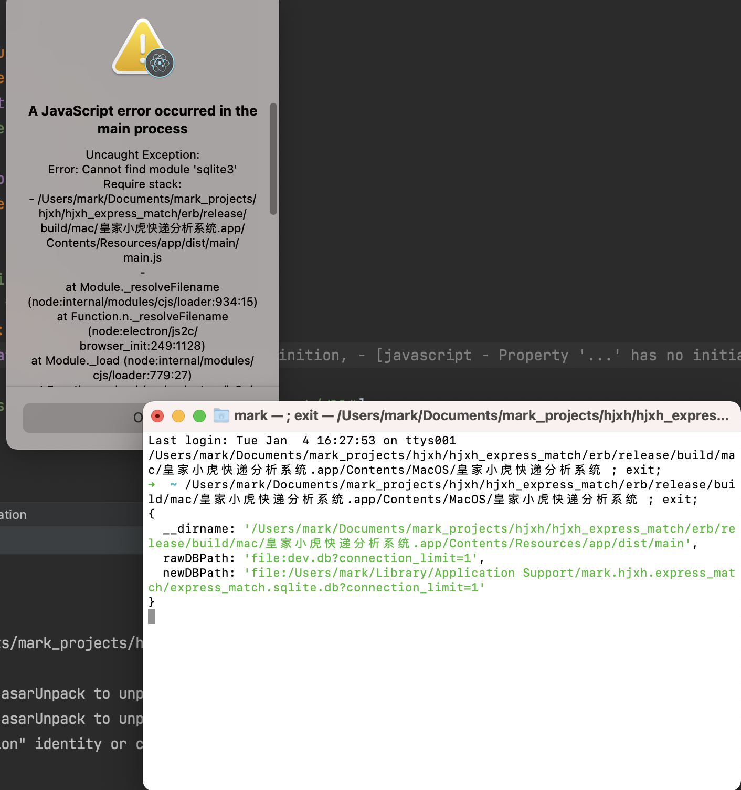  

### integrate prisma like sqlite

When add the `"@prisma/client": "^3.7.0"` into `APP/package.json`:
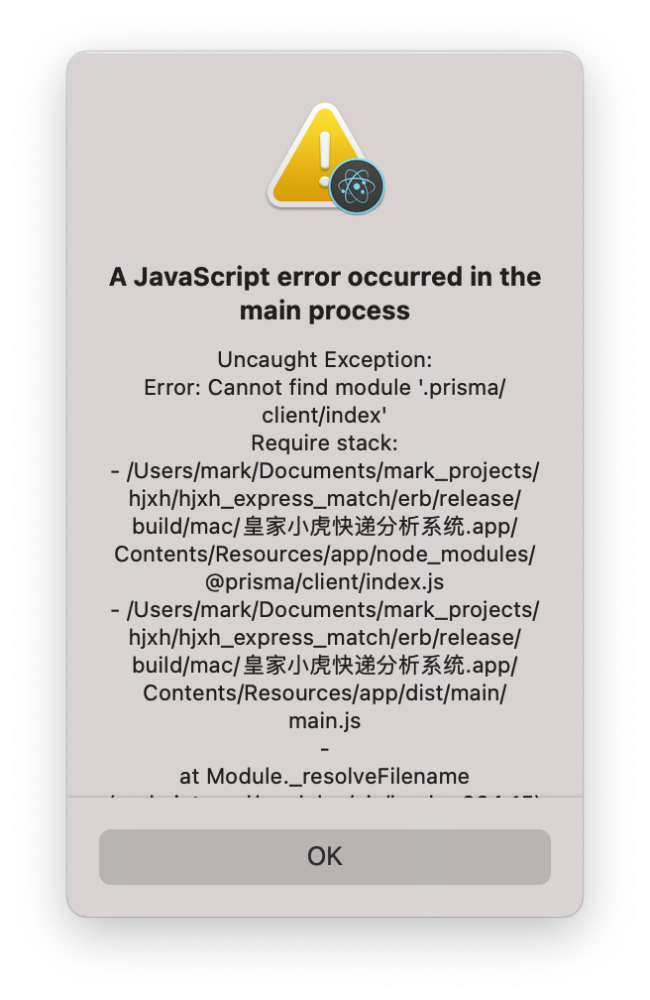  

So we then try to add `.prisma` into it.

```json
  "dependencies": {
    "@prisma/client": "^3.7.0",
    "sqlite3": "^5.0.2"
  },
  "devDependencies": {
    "prisma": "^3.7.0",
    "@prisma/client": "^3.7.0"
  }

```

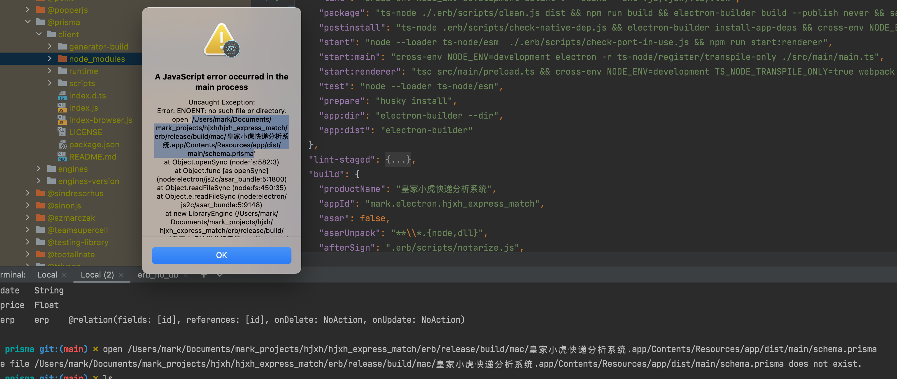  

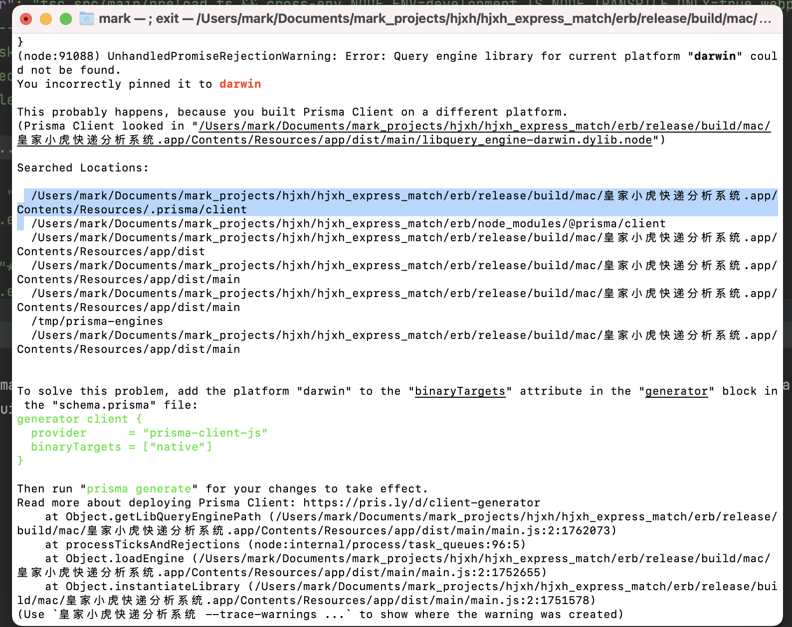  

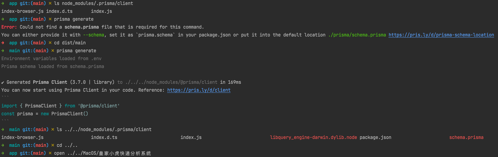  

After I moved the `libxxxxnode` into `main`, then things are ok, except still too slow!

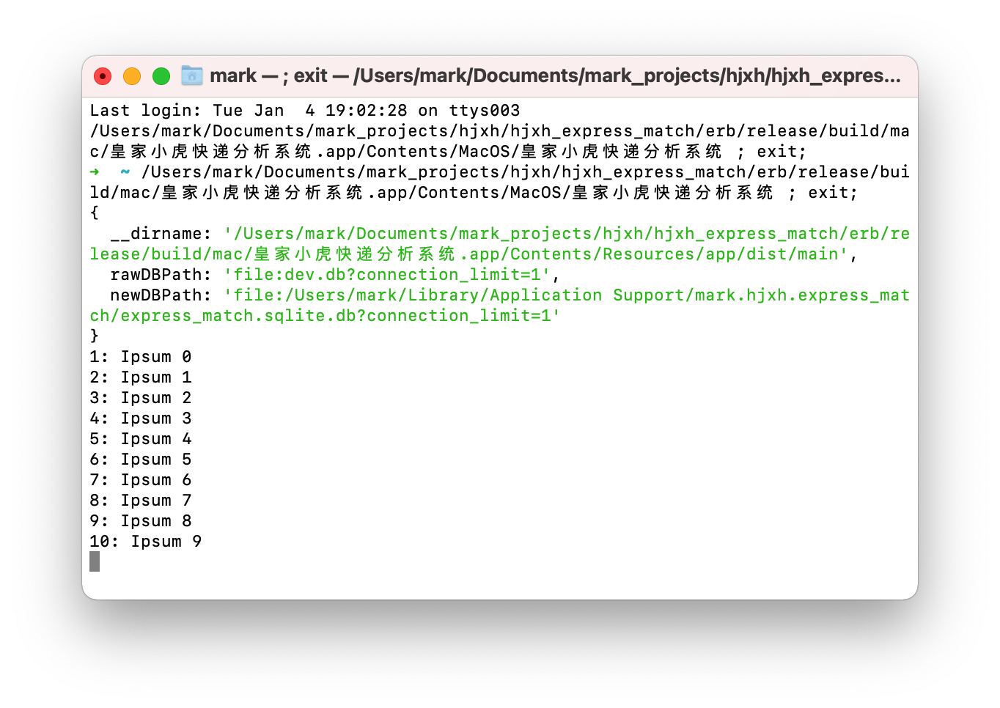  

I try to debug as [Other packages make Prisma load very slow · Issue #8484 · prisma/prisma](https://github.com/prisma/prisma/issues/8484) did:

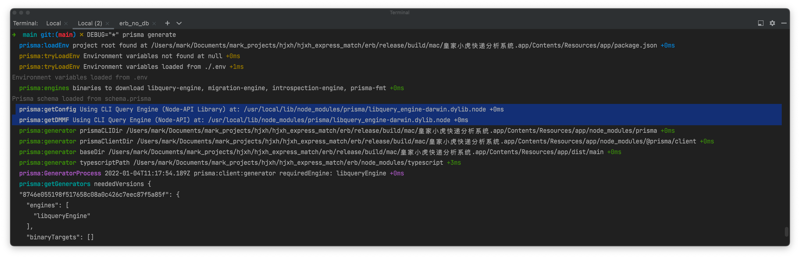  

I found this app used my local packages, which maybe the issue behind the load problem.

So I uninstalled the global prisma:
```sh
npm uninstall -g prisma
```

Then I run again.

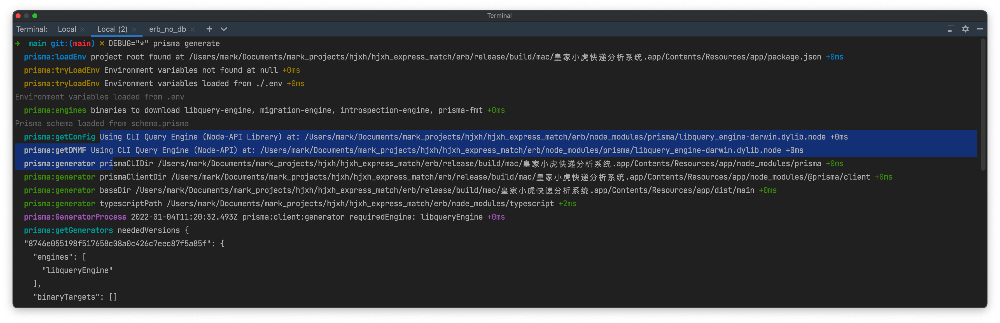  

However, it starts to use the packages in my dev project.

Finally I do a copy before I run for test:
```sh
// $erb
# copy
cp prisma/schema.prisma $app/Contents/Resources/app/dist/main/
cp node_modules/.prisma/client/libquery_engine-darwin.dylib.node $app/Contents/Resources/app/dist/main 

# run
open release/build/mac/皇家小虎快递分析系统.app/Contents/MacOS/皇家小虎快递分析系统
```

:sparkles: maybe it's because prisma is searching file location, so that the system runs slow! (since finally it didn't search any `schema.prisma`, which enlightened me!)


### I am quite sure now the problem is about package import with `prisma` 

I added one log just at the entrance of the whole programme.

  

And I am lucky to see it is printed after programme runs in binary, and then wait, which indicates the start of programme is ok, except the packages.

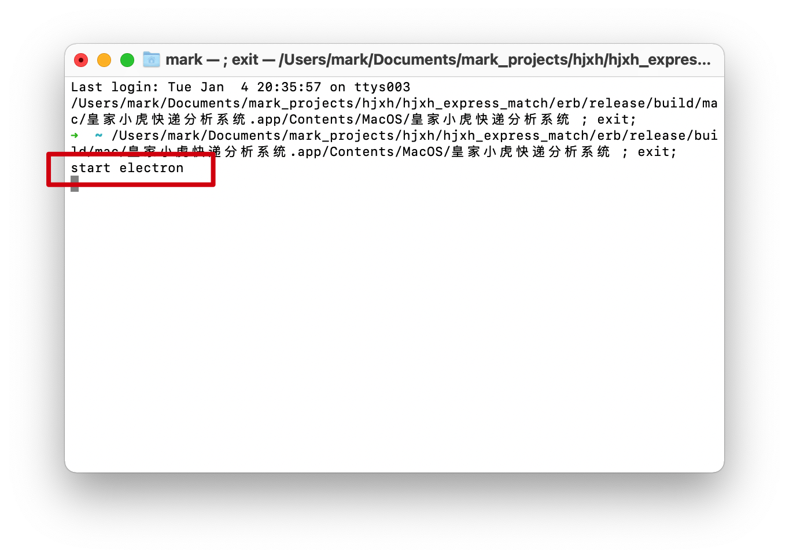  

### Yeah, thanks Mac's console, I saw the dawn :sparkles::sparkles::sparkles:!

Stupid!

I found nothing helpful!

(Since the programme didn't cause any system exception, except block)

### Finally found the problem, it's about the block of searching path

Just add these two lines for debug the `findSync` sentence.
  

Then you would know where does it go wrong.
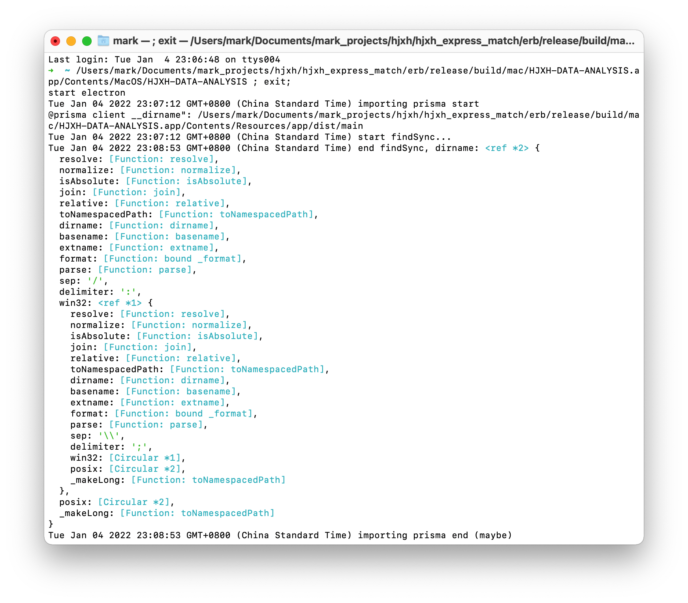  

I located to the source code.
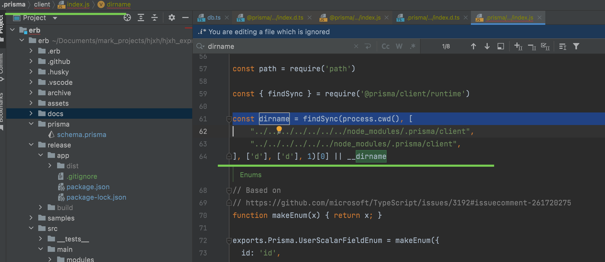  

It seems the path generated incorrectly.

Since this directory is generated via cli, I re-generate it, which looks more normal then.

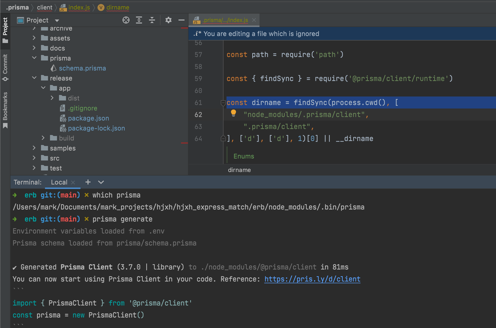  

And then we pack again.
```sh
npm run build
npm run app:dir
```

Look into what's new in the `APP/../main.js`
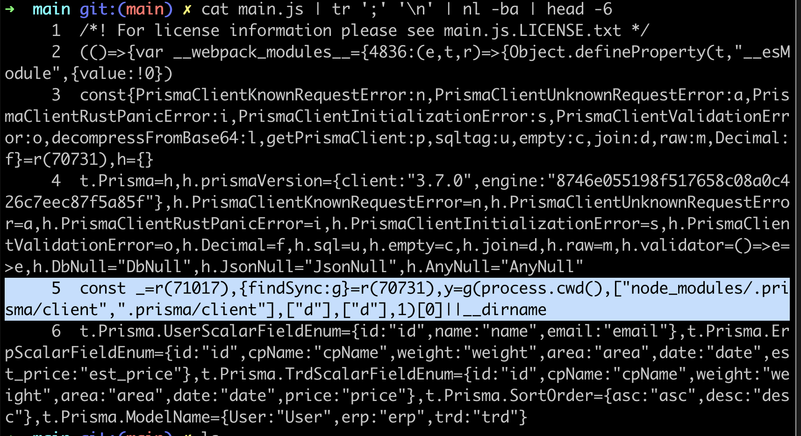  

OK, it's consistent with the source code after we `prisma generate`.

However, there's no `node_modules` neither `.prisma` under `main.js` directory now:

```sh
➜  main git:(main) ✗ ls
main.js             main.js.LICENSE.txt preload.js
```
It's because we didn't pack it into `app.asar` in electron.

So how to achieve this goal?

1. we cannot use `externalResources` choice since it only pack files into `Resources/` not `app/main/`
2. if we use `files`, then the files would list in `app.asar` under `app` directory, this is what we are looking for.
3. if we add the dependencies under `app/package.json`, then there would be `node_modules` installed under `app`. It is also suitable if there would generate a `.prisma/client`, we can give it a shot only if we add `@prisma/client` into `app/package.json`.

```json
// release/app/package.json
  "dependencies": {
    "sqlite3": "^5.0.2",
    "@prisma/client": "^3.7.0"
  }
```

However, I tried but to find there is NO `.prisma` folder in the target place.

And I tried locally to find that if I do not use `prisma generate` then I only got an blank template `index.js`, which is certainly not I want.

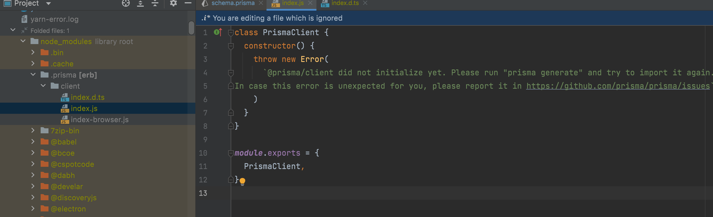  

So, the answer is clear now: we can't put `@prisma/client` into `app/package.json`, since it won't generate the right sql model unless we use `prisma generate`. And even the `.prisma` generated locally, it won't be packed into out target application's app.asar folder.

Therefore, the only way best suitable for us is to manually copy the local `.prisma` folder to `app/dist/main/` so that can be searched by `prisma` in the binary application.

We then use `prisma generate` to synchronize the `node_modules/.prisma/client/index.js` with out `prisma/schema.prisma` file (which would copied into `node_modules/.prisma/client/schema.prisma`), along with the generated query engine for MacOS: `node_modules/.prisma/client/libquery_engine-darwin.dylib.node`.[TODO: what should windows user do; maybe copy all the files into app is not ideal for cross platform use. Instead, we should consider about only copy the `schema.prisma` file, and let all the other work generated by platforms]

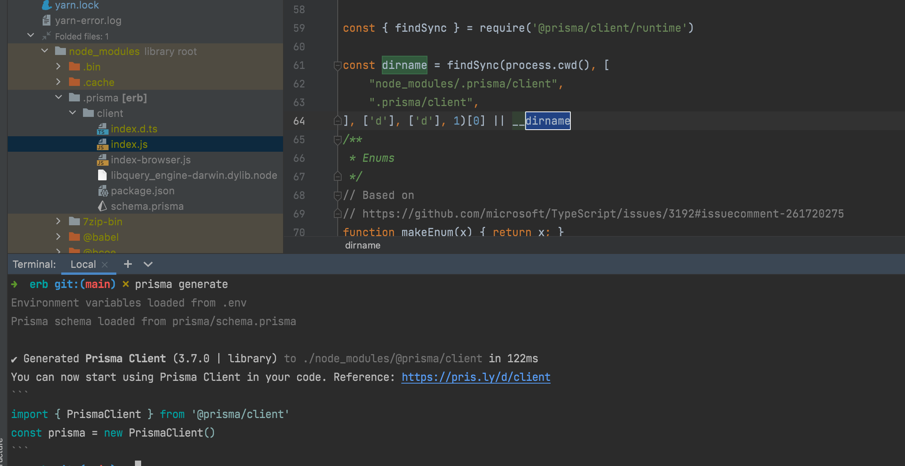  

### I finally understand why programme start by `double click` would be so slow!

I added log before `findSync` again, and run by double click of the main programme.

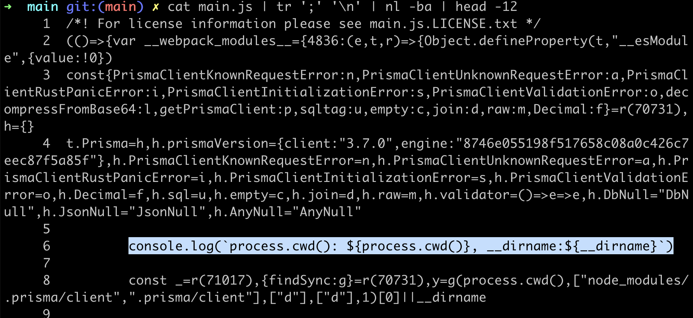  

And it should tell me that the `process.cwd()` is `/` that means from my computer root!

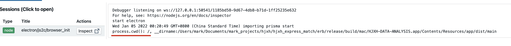  

As a contrast, I ran it according the electron helper which is within the main programme.

And the `process.cwd()` is `~`, which is much much faster!
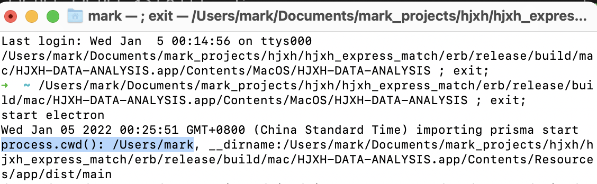  


### what's the `findSync`


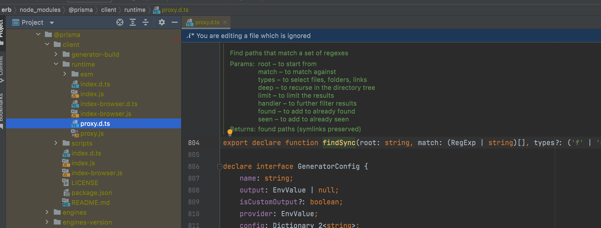  

So, according the source code, the `findSync` starts from the `root`, then to search target `pattern`.

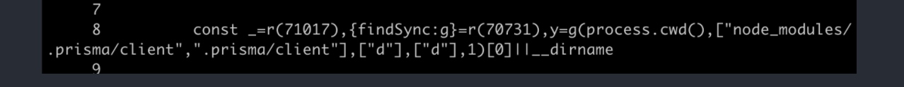  

Thus, from the commands before, we can see, it would search target pattern `node_modules/.prisma/client` or `.prisma/client` from `process.cwd()` (i.e. `/` when run main programme and `~` when run in shell)

What's the solution?

1. directly change the logic into `_ = __dirname`, and put `.prisma/client` under the `__dirname`, i.e. `app/main`

2. perhaps there's way (i.e. package or not) to not go this logic, which is so-called best practice? But sadly, I haven't found one after many times of hard search in github of prisma. I am looking forward the developers of prisma can give one.

	1. For example, maybe there is a way allows me to fill some parameters so that to disable the hard search or change the root from? 

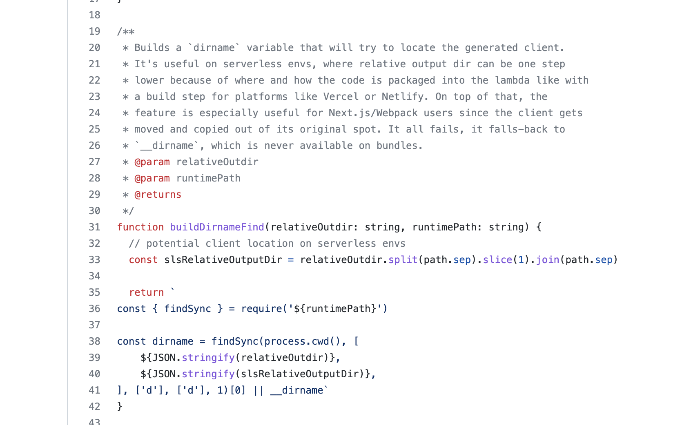  

ref:
- [prisma/buildDirname.ts at 62b91fd9bd32da983f457857411edef6daeecda1 · prisma/prisma](https://github.com/prisma/prisma/blob/62b91fd9bd32da983f457857411edef6daeecda1/packages/client/src/generation/utils/buildDirname.ts)


### Current Solution: avoid `findSync'

avoid any call of `findSync`

```js
// node_modules/.prisma/client/index.js

// to save the hard search time(maybe from '/'), let us directly point out the target prisma client place
console.log({ process_cwd: process.cwd(), __dirname });
const dirname = path.join(__dirname, '.prisma/client');
console.log({ dirname });

// const { findSync } = require('@prisma/client/runtime')
//
// const dirname = findSync(process.cwd(), [
//     "node_modules/.prisma/client",
//     ".prisma/client",
// ], ['d'], ['d'], 1)[0] || __dirname
```


```text
// main files structure of an packed electron on Mac 
// with `.prisma/client` besides `main.js`
// generate via ` find . ! -path '*node_modules/*' ! -path '*Frameworks/*' ! -path '*assets*' ! -path '*lproj'  ! -path '*svg'  | tree --fromfile --noreport -aC`

. // Main Entrance
└── Contents
	├── Frameworks
	├── Info.plist
	├── MacOS
	│   └── HJXH-DATA-ANALYSIS // Script Entrance
	├── PkgInfo
	└── Resources
		├── app
		│   ├── dist
		│   │   ├── main
		│   │   │   ├── .prisma
		│   │   │   │   └── client
		│   │   │   │       ├── index-browser.js
		│   │   │   │       ├── index.js
		│   │   │   │       ├── libquery_engine-darwin.dylib.node
		│   │   │   │       ├── package.json
		│   │   │   │       └── schema.prisma 
		│   │   │   ├── main.js // Main Runner
		│   │   │   ├── main.js.LICENSE.txt
		│   │   │   └── preload.js
		│   │   └── renderer
		│   │       ├── index.html
		│   │       ├── renderer.js
		│   │       └── renderer.js.LICENSE.txt
		│   ├── node_modules
		│   └── package.json
		└── icon.icns
```

### make binary can use `prisma db push` 

The question is to intercept `prisma` into package use, am I right?(maybe not...)

Anyway, we'd better have a try at the first: add `prisma` as a dependency of app.

  

Now, we have `prisma` in node_modules.

However, I doesn't be positive about running with `prisma` since it's only a dependency not a command.

There are at least two kinds of commands we can use, one for global, one for those under `node_modules/.bin`.

The sad truth is that only when we run `npm i prisma` in packed app, we can have a `prisma` under `node_modules/.bin`, which seems unacceptable. [TODO: so why they cannot generate a `prisma` under `.bin` when I have assigned `prisma` in `package.json` of released app]

```sh
➜  app git:(main) ✗ npm i prisma

added 2 packages, and changed 1 package in 2s

3 packages are looking for funding
  run `npm fund` for details
➜  app git:(main) ✗ ls node_modules/.bin
detect-libc  node-gyp     prisma       rimraf       sshpk-sign   which
mkdirp       node-pre-gyp prisma2      semver       sshpk-verify
needle       nopt         rc           sshpk-conv   uuid
```

So let's have a try step by step.

First, only add `prisma` in the `package.json` of release.


#### 若在`release/package.json`里指定了`@prisma/client`，则打包里没有`.prisma/client/index.js`


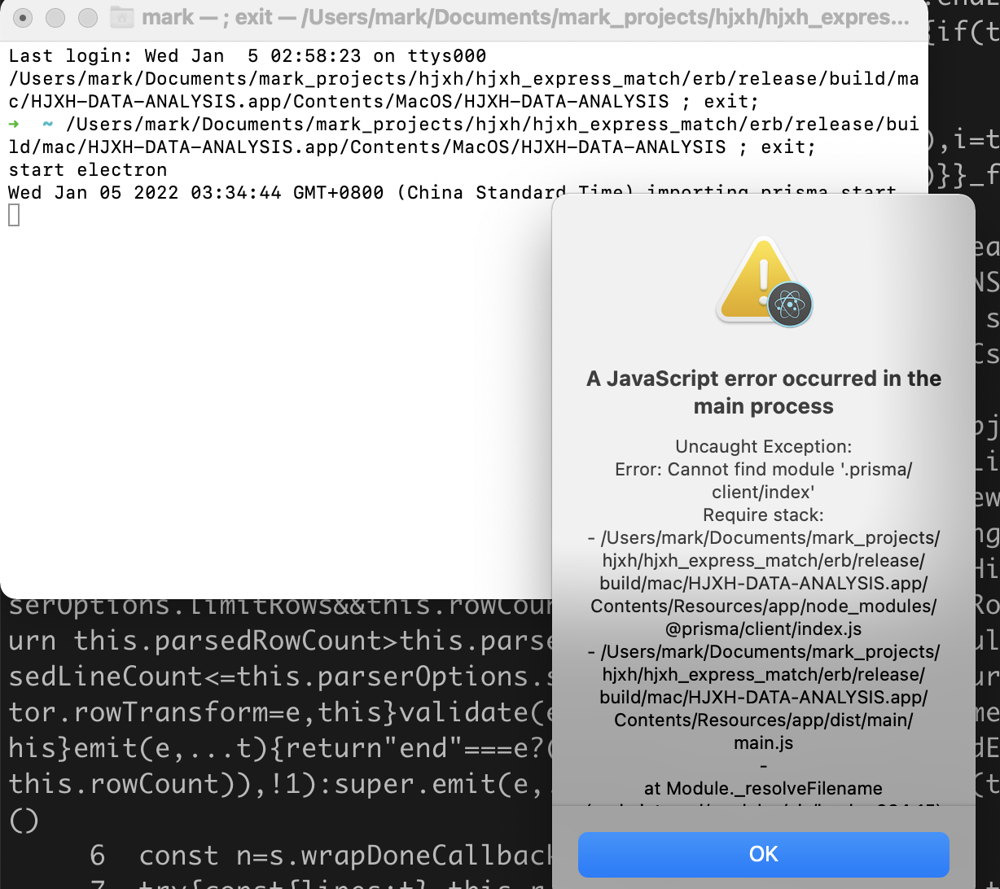  

#### 若未指定（只指定一个`sqlite3`），则有

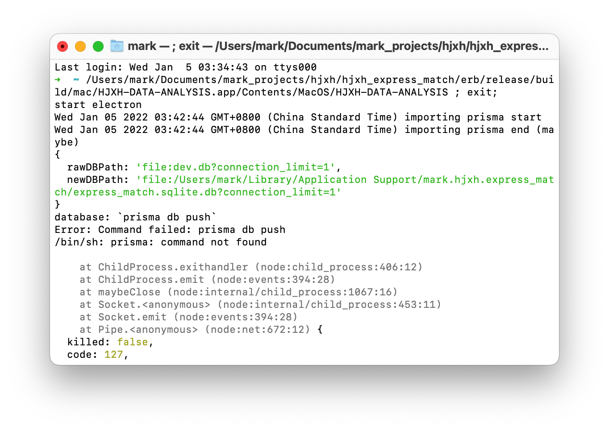  

#### 在binary里需要用`npm i prisma`安装脚本
```sh
➜  app git:(main) ✗ ls node_modules/.bin
detect-libc  needle       node-pre-gyp rc           semver       sshpk-sign   uuid
mkdirp       node-gyp     nopt         rimraf       sshpk-conv   sshpk-verify which
➜  app git:(main) ✗ npm i prisma

added 2 packages in 2s

3 packages are looking for funding
  run `npm fund` for details
➜  app git:(main) ✗ ls node_modules/.bin
detect-libc  needle       node-pre-gyp prisma       rc           semver       sshpk-sign   uuid
mkdirp       node-gyp     nopt         prisma2      rimraf       sshpk-conv   sshpk-verify which
➜  app git:(main) ✗ which prisma
prisma not found
```

但尽管如此，在程序中依旧是不可以直接用`prisma`的cli命令的，因为这个依赖于全局`prisma`。
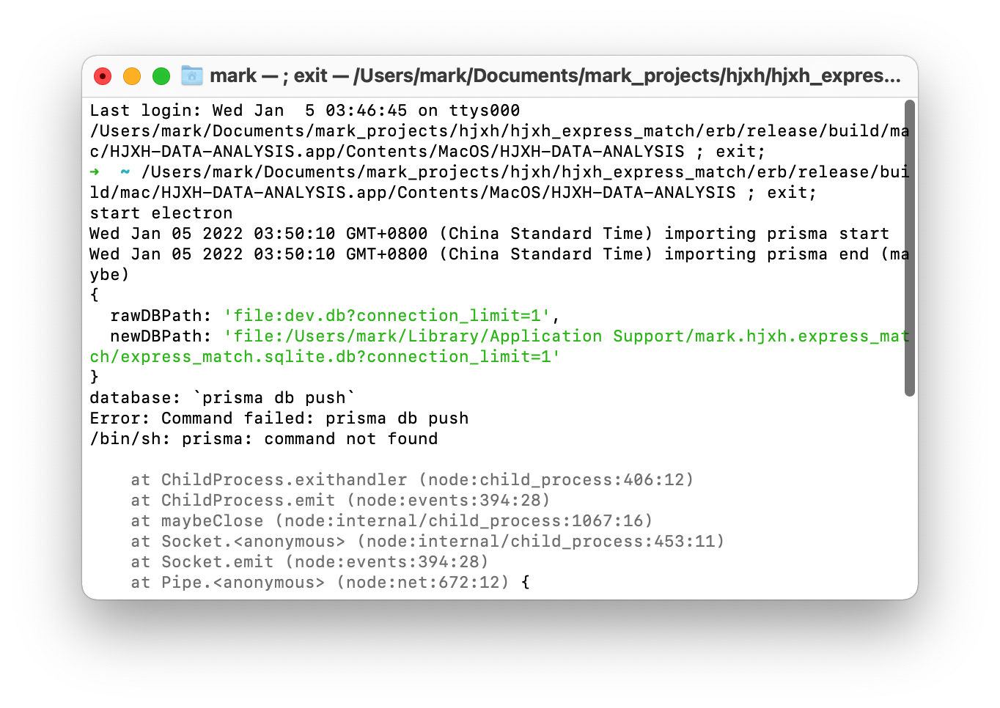  

可以考虑一下指定脚本。

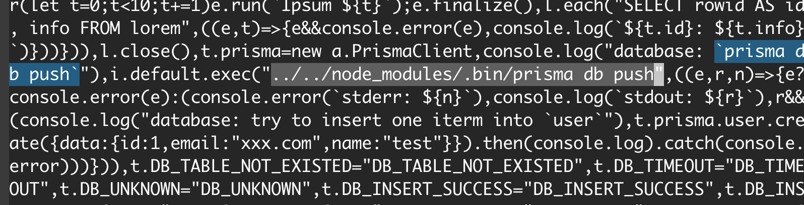  

不过脚本里用相对路径需要格外小心，`.|..`的拼接，是相对于脚本执行者的路径而言的，而不是脚本文件！

```js
const absDir=require('path').resolve("../../node_modules/.bin/prisma");
```
比如这句话，在我使用`open ./MacOS/HJXH-DATA-ANALYSIS`打开时，因为脚本执行者是`~`，即`/Users/mark`，所以它其实以这个路径为基准，最终转换成了`/node_modules/.bin/prisma`，这显然是不对的。

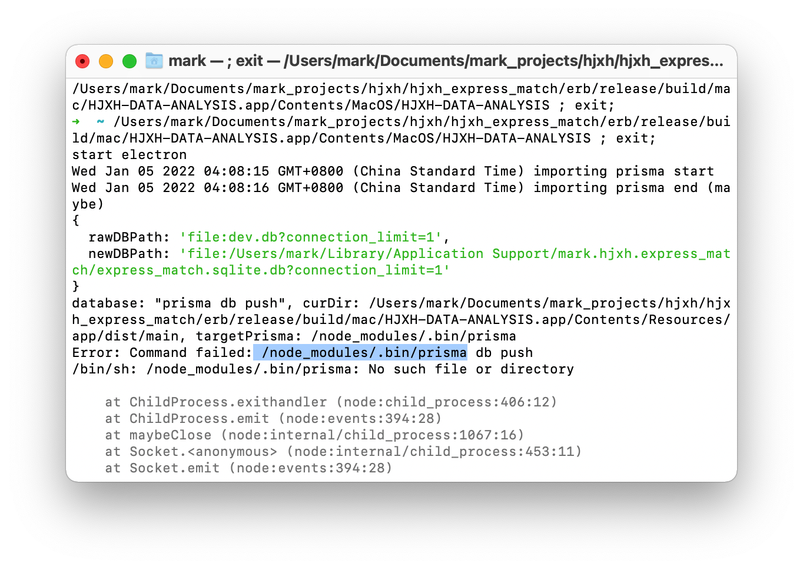  


所以在拼接时要连接上文件路径，像这样就对了。
```js
const absDir=require('path').resolve(
    __dirname, "../../node_modules/.bin/prisma");
console.log(`database: "prisma db push", curDir: ${__dirname}, targetPrisma: ${absDir}`);
```

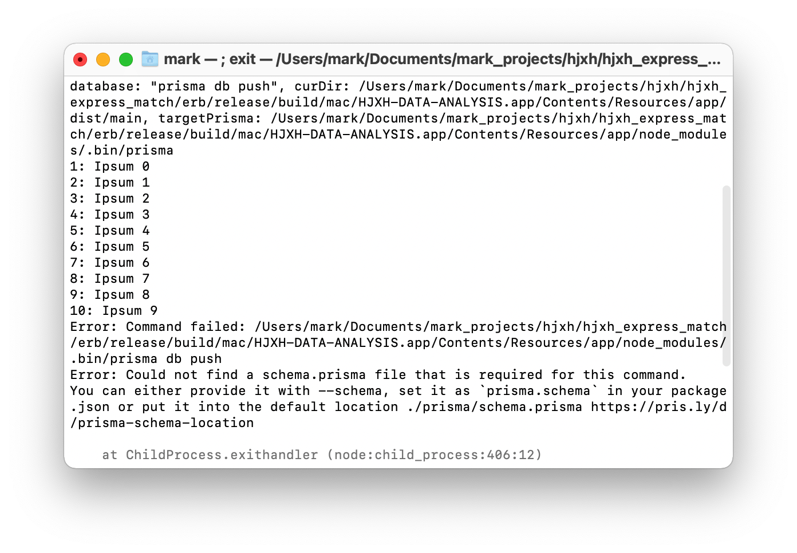  

不过接下来又报文件找不到了，不过这是小事，马上解决。

这里总结一下：
1. 在二进制程序里，用全局命令是不合适的，比较好的是用自己包里的命令，但这不像开发环境那样仿佛天生就有，具体要先`npm i prisma`安装生成`.bin/prisma`可执行文件，然后再用绝对路径去引用它，当然，我们既然可以执行命令行，当然也可以导出一个变量。
2. TODO： 将prisma命令导出，这样，在其他地方都可以用prisma了
3. TODO: 我忘了。。


#### 指定prisma文件
注意看上面的报错，其实它已经提供了我们方法了，就是将`schema.prisma`放到指定位置，即`prisma/`下。

不过这里也能看出，他们的代码规范不统一，比如`prisma.schema`在主程序中，被搜索的路径可不止这点，而且貌似还是以`schema.`优先的，而不是`prisma/schema.prisma`。

方法1. 在`package.json`中加入`prisma.schema`字段
方法2. 移动目前的文件（从`schema.prisma`到`prisma/schema.prisma`）

这里就用方法1了：
```json
// app/package.json
  6   "prisma": {
  7     "schema": "dist/main/schema.prisma"
  8   },
```

然而还是报错了。

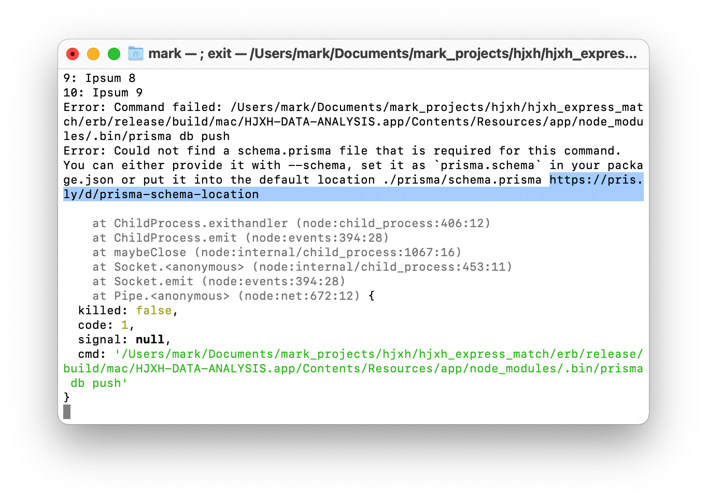  

我验证了一下路径，是没问题的，于是顺着链接去官网看了看，突然就意识到了，这可能又是相对路径的问题。

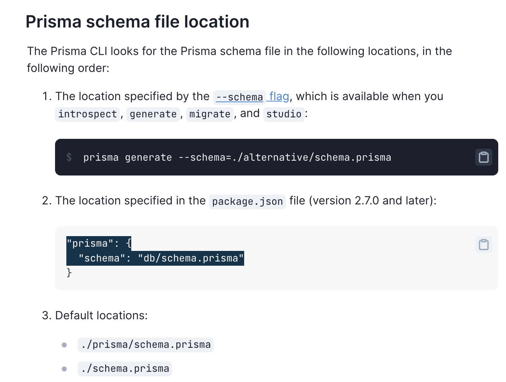  

为验证我的想法， copy一份为`prisma/schema.prisma`，预期应该还是不行，因为都是相对路径，根据官网的搜索路径`./prisma/schema.prisma`就变成了`~/prisma/schema.prisma`，`./schema.prisma`就变成了`~/schema.prisma`。

不出所料，果然！即便我路径里已经包含了两种`prisma`，它都找不到，就是因为相对路径拼接错误。

```text
➜  main git:(main) ✗ tree .
.
├── main.js
├── main.js.LICENSE.txt
├── preload.js
├── prisma
│   └── schema.prisma
└── schema.prisma
```

所以，我们应该自己指定路径了，既然这样，那么在`package.json`中指定路径也没有意义了，因为绝对路径肯定要基于文件路径拼接的，所以只能在程序中动态拼接。

```js
  3 const _p = require("path");
  4
  5 const schemaExePath = _p.resolve(
  6     __dirname, "../../node_modules/.bin/prisma");
  7
  8 const schemaFilePath = _p.resolve(__dirname, "schema.prisma");
  9
 10 console.log(`database: "prisma db push", curDir: ${__dirname}, targetPrismaExeP    ath: ${schemaExePath}, targetPrismaFilePath: ${schemaFilePath}`);
 11
 12 i.default.exec(`${schemaExePath} db push --schema ${schemaFilePath}`,
 ```

#### `prisma/client`
OK！用路径拼接转绝对路径的方式，解决了上面的问题【TODO:给prisma提一个pr，考虑一波基于文件的路径拼接，而非process，要烦死了】，新的问题就是装一下`prisma/client`，

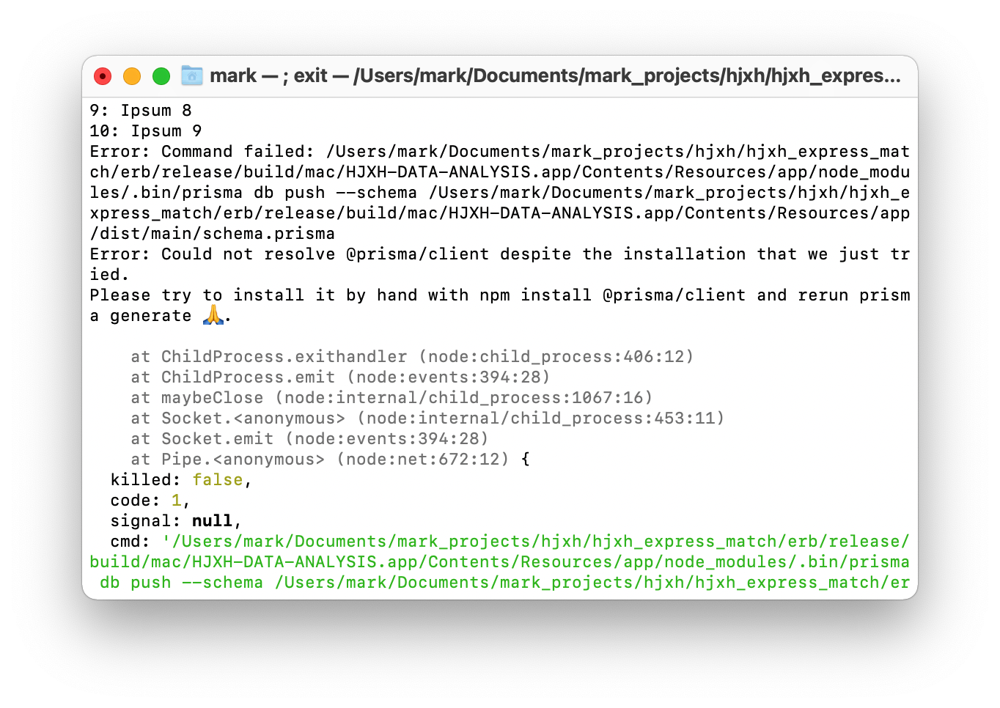  

这个比较简单。不过也有两种办法：
1. 直接命令行安装：`npm i @prisma/client`
2. TODO:尝试把外部包导入看看是不是就不需要装了

这里用第一种办法：

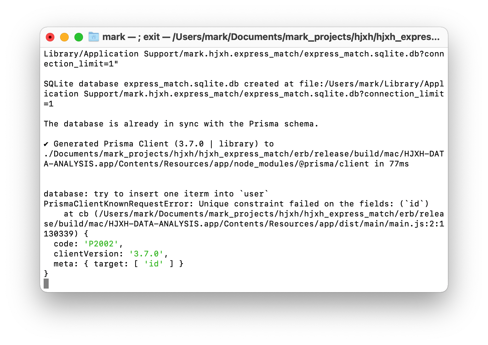  

成了！

#### 极小自动化程序搭建
1. prisma init and generate --> in order to generate target table
2. change `findSync` function to fasten speed --> in order to avoid search from pc root, which would cause even minutes wait
3. move `schema.prisma` into `release/app/` --> easy and default for programme search, which is consistent when in local development since `schema.prisma` is besides `index.js` under `node_modules/.prisma/client/`
4. use path-merge to generate ABSOLUTE path, both for `.bin/prisma` and `schema.prisma`  --> in case for the default merge behavior of prisma is wrong when the base path is offered by programme rather then by file.
5. install `prisma`/`@prisma/client` in binary or try to pre-install


### FIXME: `prisma` in binary

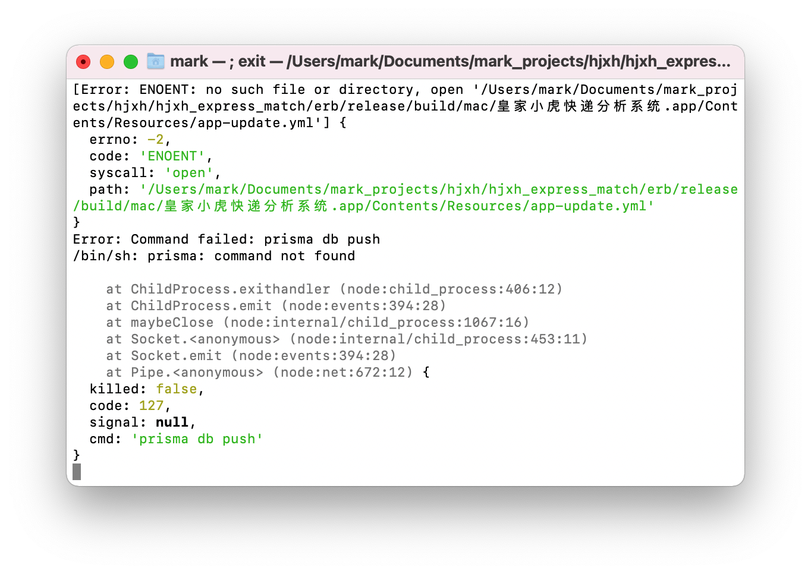  


When I didn't install `prisma` globally, neither had I placed `prisma` into binary, then the error `prisma command not found` occurred:

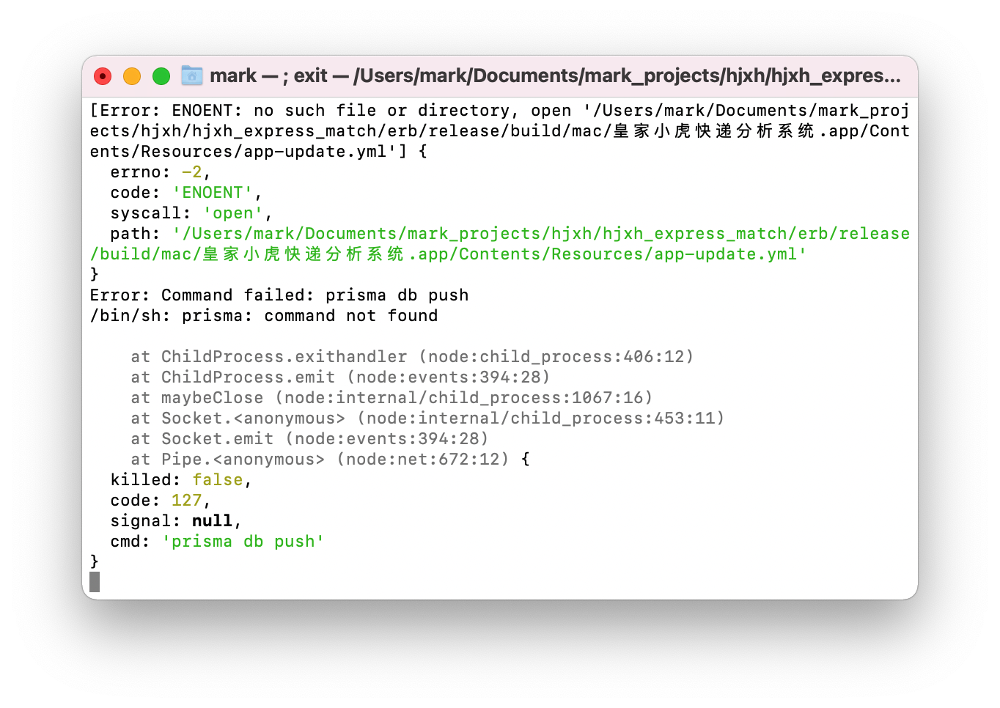  


When I installed `prisma` globally, the error then came from `prisma file not found`.

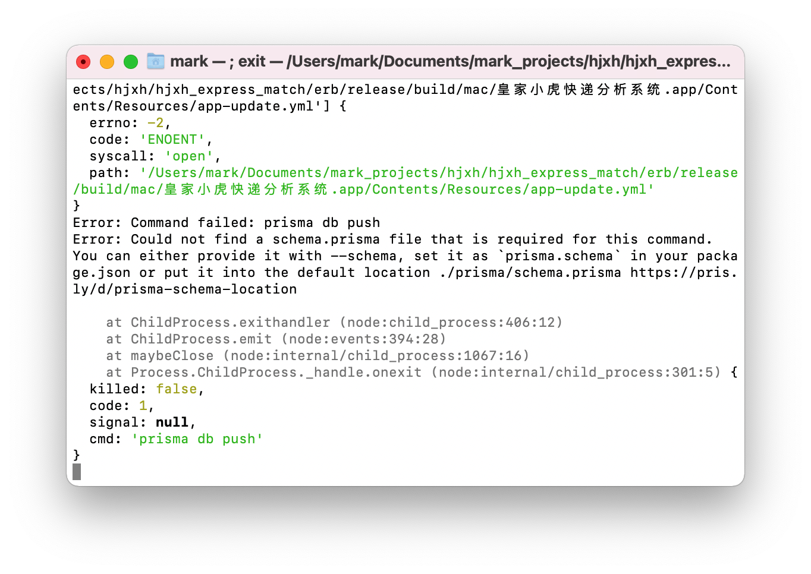  

So:

| install prisma globally | :white_check_mark: | :x: | 


But when I added `prisma` file in the `package.json`:

```json
// package.json
    "extraResources": [
      "./assets/**",
      "prisma/schema.prisma"
    ],
```

And it did go to the target application at: `build/mac/皇家小虎快递分析系统.app/Contents/Resources/prisma/schema.prisma`

The file cannot be found yet in fact.

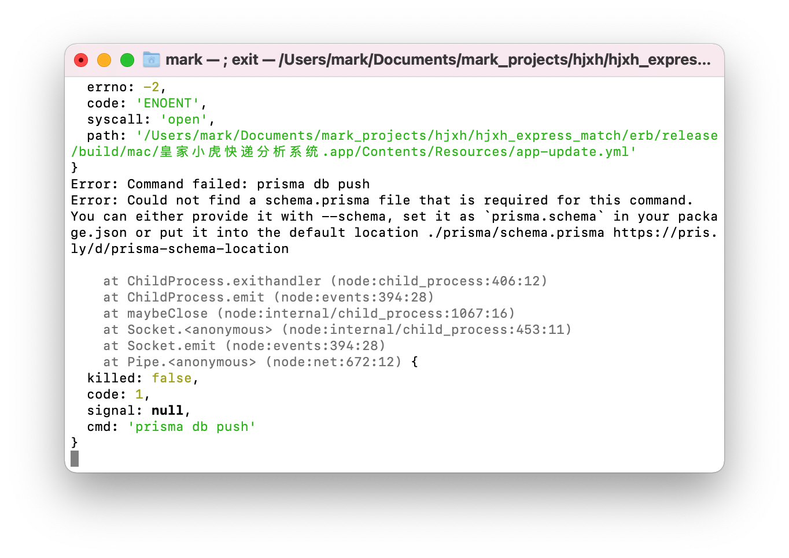  

I thought of adding into `files` so that it can go to the `app.asar`, but in vain:

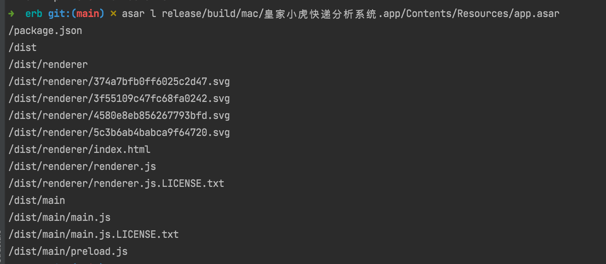  

Also failed for (in case it uses the relative path to `release/app`):
```js
     "../../prisma/schema.prisma",
```


### :white_circle: add log module
### :white_circle: 实现TRD的数据读取与存储
### :white_circle: 实现TRD与ERP的对比


## Finished/Bugfix

### :white_check_mark: db init with `generate table in source code` or via `.env`.
2022-01-04，it's very successful and valuable to finally solve this problem!

### :white_check_mark: change `asar: false`. 2022-01-03 tried this option, but does no help to out project, except let me more clear about what there are in the archive.

### :white_check_mark: add electron menu. 2022-01-02

### :white_circle: replace the progress stream, since it doesn't synchronize with the database, and not accurate for percentage measure。2022-01-02 19:49:20。

I have done some research on how to do the `pipe` on node stream, and learned a lot.

In fact, I first browsed node.js documentation, but in a loss.

Then I dived into the source code of the package I am using: `progress-stream`, and realized he used the dependent package of `through2`.

Then I followed the github of `through2`, which gave me the following valuable instruction:
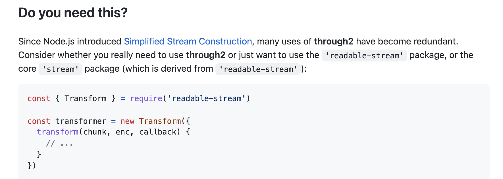  

Hence, based on my knowledge, I diy one for simplicity without any third package.

```ts
import { Transform } from 'stream';

import { round } from '../../../../universal';

export class SizeTransformer extends Transform {
  private hasRead = 0;

  private readonly size;

  private readonly f;

  constructor(size, f: (size: number) => void) {
    super();
    this.size = size;
    this.f = f;
  }

  _transform(chunk, _, callback) {
    // @ts-ignore
    this.push(chunk);
    this.hasRead += chunk.length;
    const pct = round(this.hasRead / this.size, 3);
    this.f(pct);
    callback();
  }
}
```

And also, I came up with the idea of using two percentage calculator, one for read file size, one for saved rows.

Afterwards, I realized the final ideal effect, which is accurate and lovely -- two circular progresses:

  

Thanks for all !

ref:
- [stream 流 | Node.js API 文档](http://nodejs.cn/api/stream.html#class-streamwritable)


- [API 文档 - Node.js 中文网](http://api.nodejs.cn/)

- [rvagg/through2: Tiny wrapper around Node streams2 Transform to avoid explicit subclassing noise](https://github.com/rvagg/through2)

- [through2原理解析 - SegmentFault 思否](https://segmentfault.com/a/1190000011740894)

### :white_check_mark: add the global settings json file, so that the frontend and the backend can mutually use it。2022-01-02 17:04:24。

### :white_check_mark: 省份匹配。2022-01-02，用之前的程序改成js版即可。

### :white_check_mark: 测试ERP的数据读取与存储。1-1: finished.

### :white_check_mark: 优化文件读取过程中的前端界面展示。12-31: finished。

### :white_check_mark: TS2339: Property 'erp' does not exist on type 'PrismaClient '. 12-28: The solution is to use `npx prisma generate`.

### :white_check_mark: 解析数据有误问题
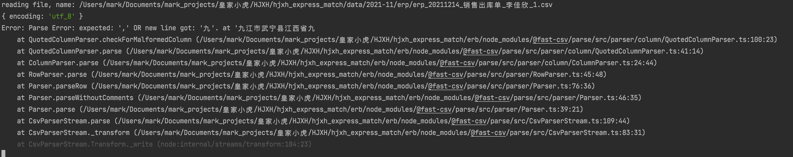  

webstorm csv
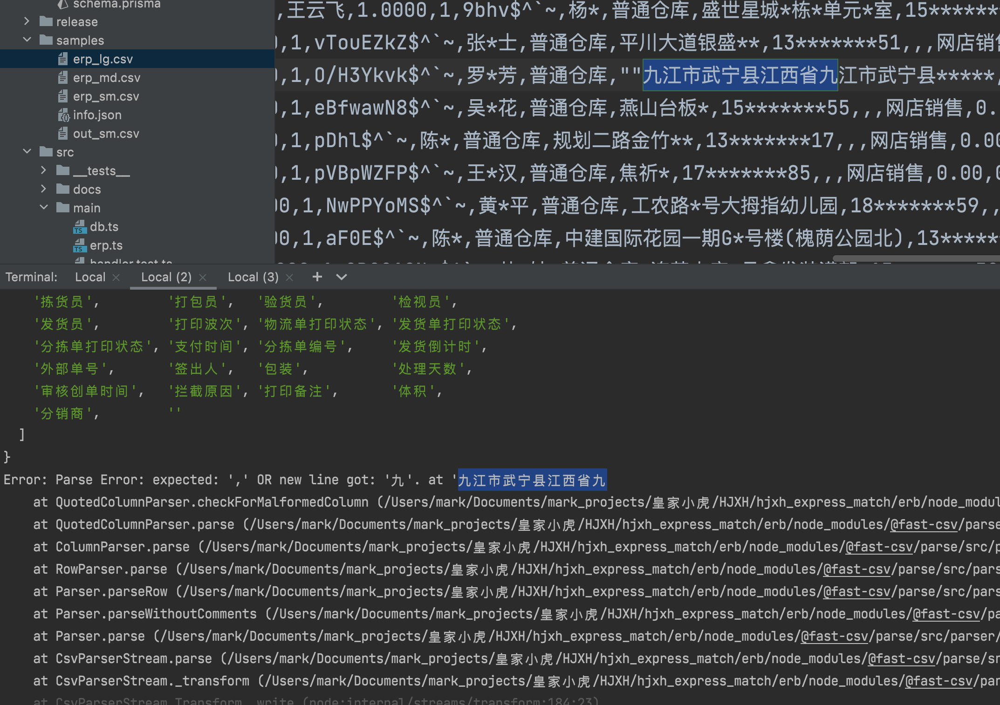  

wps csv
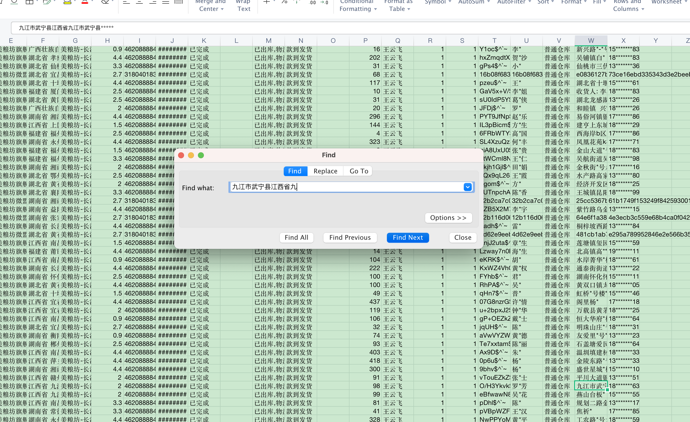  

sublime csv
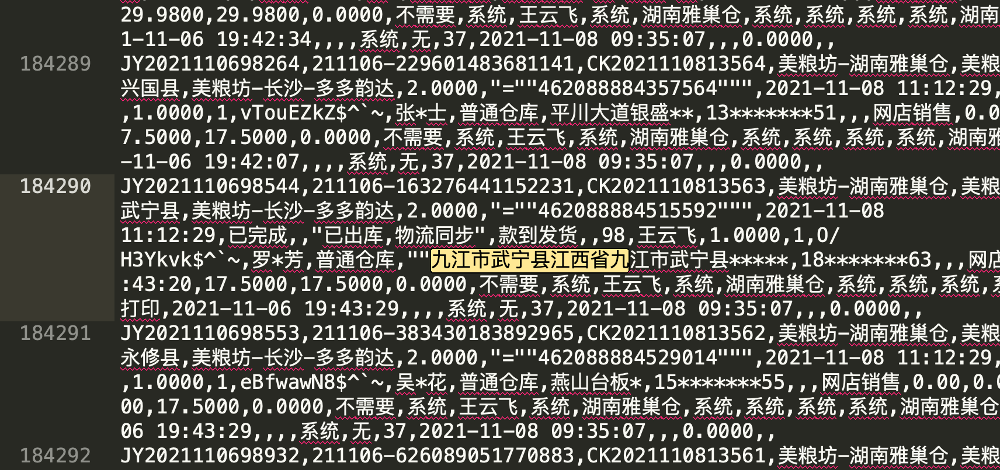  

:heart: attempt to save to wps [update: 不愧是我]
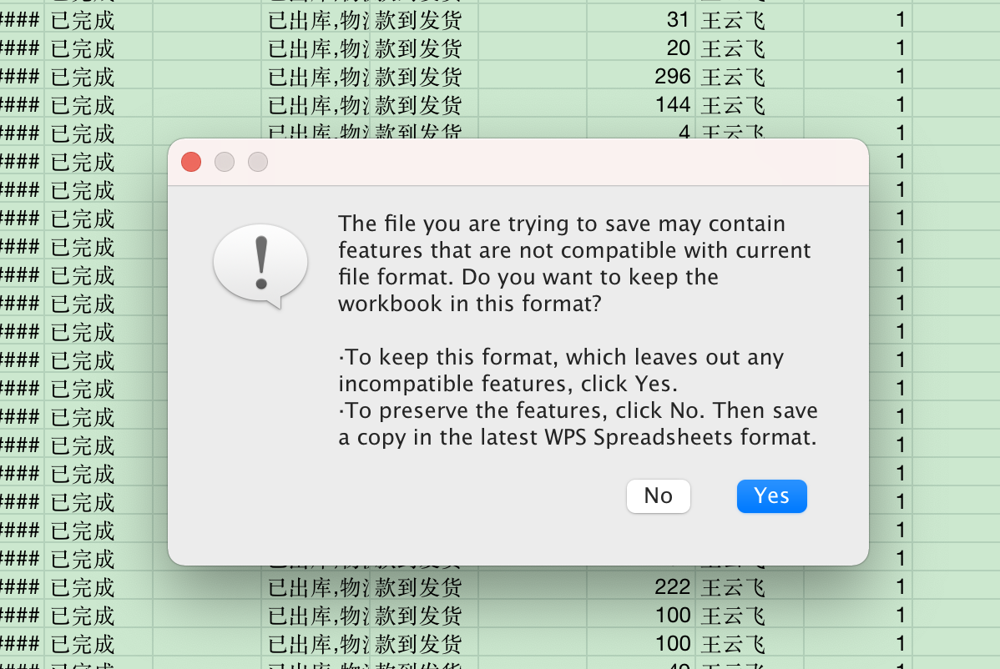  

This solution is rather robust, and does solve my problem, which achieves a balance between server code and user experience! 

What a genius I am that a flash of inspiration occurred to my mind which suggested me to give 're-saving' a shot :heavy_exclamation_mark:

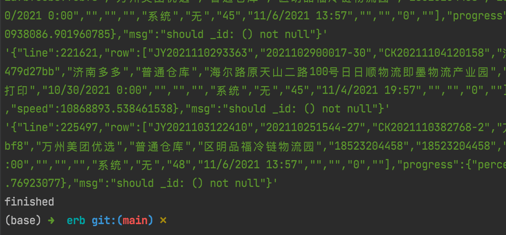  


### :white_check_mark: `sqlite3、typeorm` native dependency

2021-12-30 update：there is no need to think about `typeorm` any longer since I have decided to use `prisma` which works well.

安装`sqlite3, typeorm`之后没法运行`electron`了
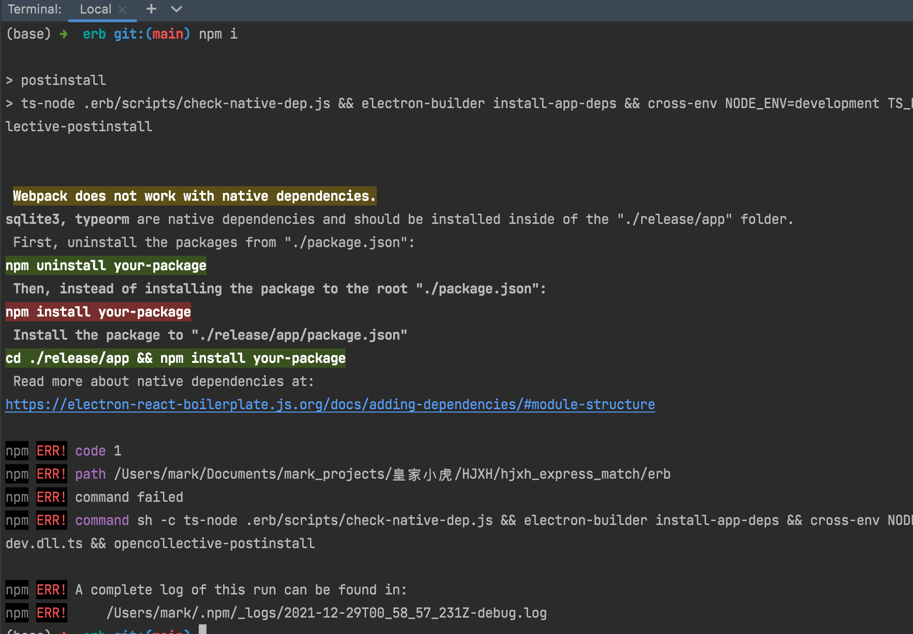  

ref:
- [What is exactly native dependency? · Issue #1042 · electron-react-boilerplate/electron-react-boilerplate](https://github.com/electron-react-boilerplate/electron-react-boilerplate/issues/1042)


### :white_check_mark: 学习`prisma`的连接与插入业务流设计范式。

方案：`prisma`会在第一次query时自动连接数据库，拥有一个数据库连接池，所以无需我自己管理。ref: [Connecting and disconnecting (Concepts) | Prisma Docs](https://www.prisma.io/docs/concepts/components/prisma-client/working-with-prismaclient/connection-management)

### :white_check_mark: csv只读取第一行

方案：在`fast-csv`的第一个回调里处理就可以，这里就是第一行；如果不是行的话，可以用`fs`的`start | end`参数控制。

### :white_check_mark: 寻求`fast-csv` skip error的方案。

结果：官方回复：[Skip row at on('error') event ](https://github.com/C2FO/fast-csv/issues/179#:~:text=No%2C%20if%20an%20error%20is%20encountered%20it%20is%20usually%20because%20the%20parser%20is%20unsure%20how%20to%20proceed%20with%20the%20file%2C%20and%20can%20lead%20to%20very%20unpredictable%20results.)

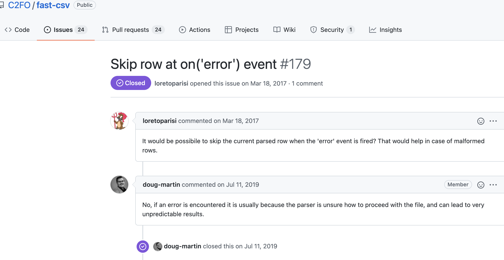  

### :white_check_mark: 支持上传的文件的 Sample 备份预览（包含head与tail五行）。

这是之前的方案，目前已经不采用，目前不存在0/1的问题，即不是按文件为基本单位传输给用户，而是在读取过程中持续地按行为基本单位（可选：筛选出有问题的部分）传输给用户，因此备份预览没有意义也不需要了。


### :white_check_mark: 完成数据库、前端、后端的基本设计。2021年12月22日

### :white_check_mark: no-headers pass but headers not
The reason is that I wrote condition of `_id === null` with always return `true` since the default 'error result' is `""`, an empty string not `null`.

So, I remedied it by changing the condition to `!_id` which can detect not only `null` but also 'empty'. And then I fixed this bug.

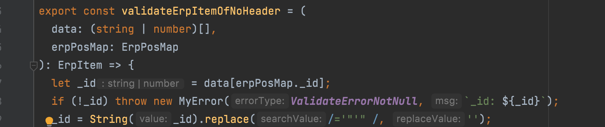  


### :white_check_mark: `progress-stream` cause bug

2021年12月29日04:47:04，在引入`progress-stream`包后导致了`csv`解析的错误，后来测试发现，只要把`progress-stream`放在`fast-csv`之前就行了。想来也是，毕竟`progress-stream`是处理`stream`的，而`csv`那一步已经变成`row`了，具体细节我也不明白也不是很重要，这里会用就行了。
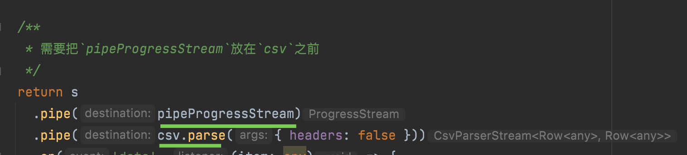  
- [freeall/progress-stream: Read the progress of a stream](https://github.com/freeall/progress-stream)
- [progress-stream - npm](https://www.npmjs.com/package/progress-stream)
- [node.js - streams with percentage complete - Stack Overflow](https://stackoverflow.com/questions/17798047/streams-with-percentage-complete)

### :white_check_mark: `try...catch...finally` problem

:white_check_mark: 2021年12月29日03:40:04，`try...catch`结构中，`finally`为什么会提前结束？事实上这个问题是我对js中的`try...catch...finally`理解不够深刻，还拿着`python`中的同步思维去理解的。js里的这套结构体远比我想象地复杂，但是呢，为了避免这种复杂（在`try`或者`catch`中各种乱返回），一种好的办法就是只在`finally`里返回（当然，这点我是知道的，只不过没有把它当做信仰）。

更新：我后续在那块代码中修改了写法，剔除了`try...catch...`，所以`finally`的问题也就不存在了。

启示：尽量不要在异步程序中使用`t...c...f`，否则可要小心了。

- [Finally in Promises & Try/Catch - DEV Community](https://dev.to/annarankin/finally-in-promises--trycatch-2c44)
- [javascript - Why does a return in `finally` override `try`? - Stack Overflow](https://stackoverflow.com/questions/3837994/why-does-a-return-in-finally-override-try)

### :white_check_mark: ipcRenderer duplicate response

2021年12月29日01:03:02，ipc通信中前端逐步累积渲染问题，猜测原因，可能是1. `ipcRenderer`中的端口使用`on`导致重复监听，并且最后的`removeAllListeners`方法没有生效；2.`react`问题。貌似重新启动一下`electron`就好了……

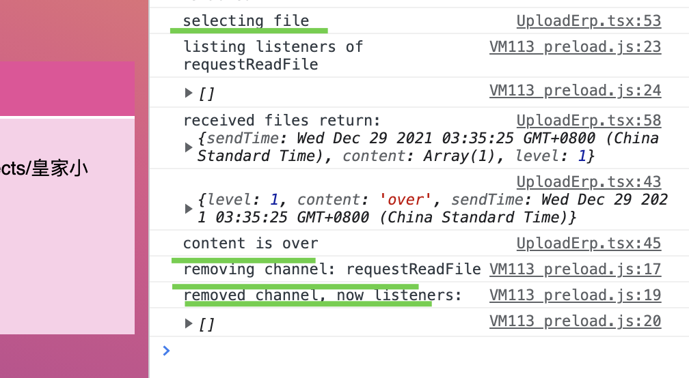  

更新：实际上这个问题，是由`try...catch...finally`使用不当导致的，和`electron`、`react`都没关系，它们的部分都是正常的，`electron`的`listener`监听部分失效，但是重新启动一下它也正常了。关于`t...c...f`问题见[:white_check_mark: `try...catch...finally` problem](#--x-trycatchfinally-problem)

### :white_check_mark: how to asynchronously and partially read csv

csv异步、小量快读读取.csv文件头部信息，以确定编码。已实现，基于`fast-csv`解决了中文乱码导致`node-csv`无法读取的问题，同时基于`iconv`实现了`gbk`与`utf-8`之间的无缝转换

### :white_check_mark: which to choose: `node-csv` or `fast-csv`

csv文件读取的选型与方法。经过鉴定，`node-csv`的接口比较低级，`fast-csv`更高些，并且更加稳健，输出方式（可以设置headers有或者无）比较友好，所以选择`fast-csv`。在读取上，有`fs.read`，`fs.readFile`，`fs.createReadStream`等几种方式，经过比较，`fs.read`接口比较低级，速度快，适合用于编码测试；等测试完后使用`fs.createReadStream`处理流数据比较好，方便与`iconv`、`fast-csv`等配合。

### :white_check_mark: axios `form-data` parse bug
本地前端上传文件`options`信息：

远程前端上传文件`options`信息：

这是在前端进行文件上传的断点调试

基于这个，再进行服务端文件调试，比对文件信息的不同。但是现在的问题是服务端进入不了程序逻辑，直接被fastapi拒绝了。


## 业务问题

### :white_check_mark: ERP表中，计算价格错误
目前已发现的主要有两种错误：
1. 收货地区填写不规范（6/50+w），导致未能正确识别省份名称，例如：


更新：对于这种问题，直接提示报错即可。

2. 重量为0（这个还比较多，146/50+w），无法理解,例如：
  

更新：对于这个问题，一开始是某张表给的问题，后续小范围问题可以直接报错提示。


### :white_check_mark: 第三方表匹配不上ERP表
更新：初期是因为发现有很多表的id导出是`=`开头的，后期加了稳健的检测与转换，这个问题就基本没了。

### :white_check_mark: 第三方报表格式
注意到发来的第三方对账单，例如："11月第三方仓韵达"是Excel格式，且包含着"订单明细wms"表与"快递核算标准"表，请问这个应该属于"惯例"吧？
anyway，这个倒不是啥问题哈，个人可以接受。

更新：这个问题其实不重要，因为有一个专门的快递核算大表，可以根据那个进行运费计算。


### :white_check_mark: 第三方表字段含义
  

1. 发货订单号 和 快递单号 之间的区别？该选用哪个？
2. 涨价金额 是不是无关紧要？

更新：目前直接规定死字段。


## 设计

### 工作流设计

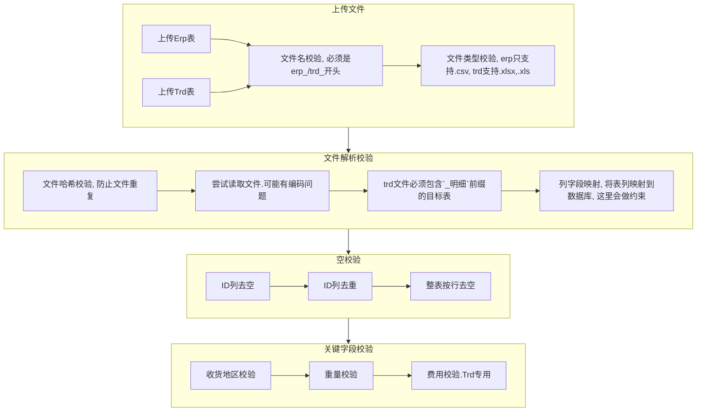
```mermaid
flowchart TD;

subgraph Part1Upload[上传文件]
UploadErp[上传Erp表] & UploadTrd[上传Trd表] -->
Step1FileNameValidation[文件名校验, 必须是erp_/trd_开头]--> Step2FileTypeValidation[文件类型校验, erp只支持.csv, trd支持.xlsx,.xls]
end

subgraph Part3FileReadValidation[文件解析校验]
Step1FileHashValidation[文件哈希校验, 防止文件重复]-->
Step2FileReadAttempt[尝试读取文件.可能有编码问题]--> 
Step3TargetSheetLocate[trd文件必须包含`_明细`前缀的目标表]-->
Step1ColumnsMap[列字段映射, 将表列映射到数据库, 这里会做约束]
end

subgraph Part4DataFrameParse[空校验]
Step1IdDropNa[ID列去空]--> 
Step2IdDropDuplicate[ID列去重]--> 
Step3DropNa[整表按行去空]
end

subgraph Part5FieldsValidation[关键字段校验]
Step1ProvinceValidation[收货地区校验]-->
Step2WeightValidation[重量校验]--> 
Step3FeeValidation[费用校验.Trd专用]
end

Part1Upload--> 
Part3FileReadValidation--> 
Part4DataFrameParse--> 
Part5FieldsValidation
```


### 数据库的选择

对数据库选择的倾向：mongodb --> mysql --> sqlite3

【2021年12月28日】我是觉得，应该用`sqlite3`，也是今天才意识到的。
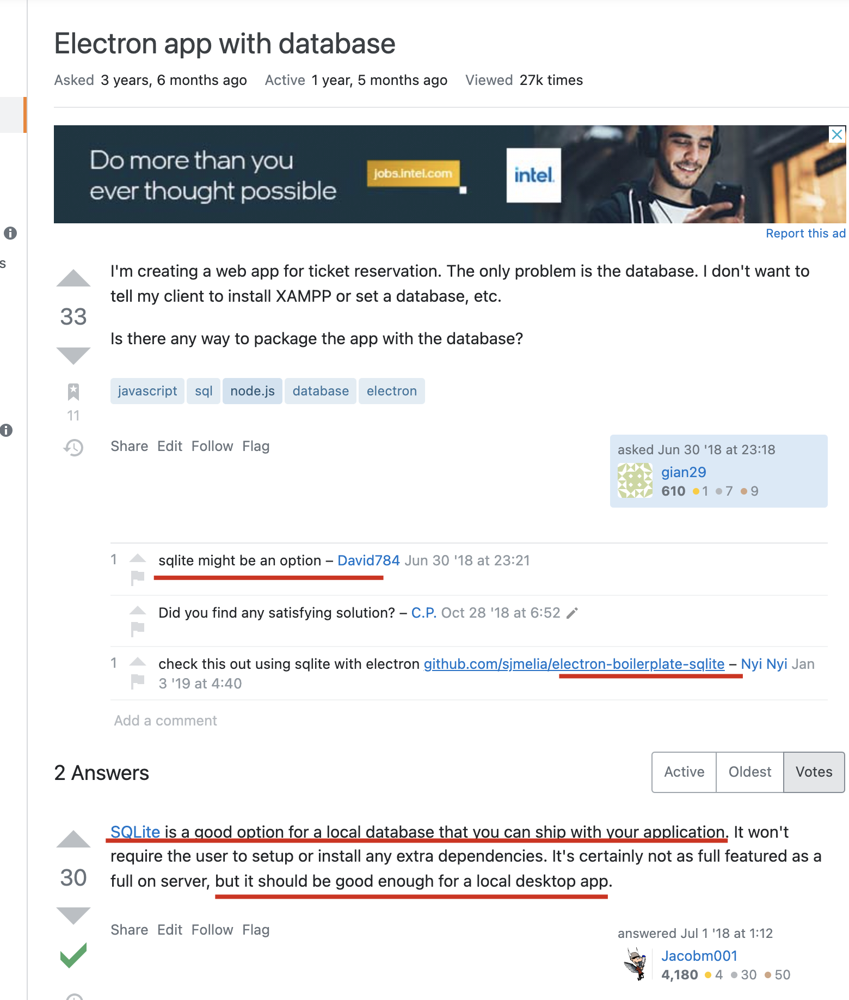  
ref:
- [javascript - Electron app with database - Stack Overflow](https://stackoverflow.com/questions/51119248/electron-app-with-database/51119689)


### 数据库的表设计

数据库的设计里，我初步是想基于"年-月"设计表的，但这样的话，对于用户上传的表，就要逐一进行时间提取并标记然后分类，效率势必非常之慢，所以不可行。

为了支持用户高速批量导入，应该将用户所提交的表视为无状态的表，比较合适的是，按照快递公司进行分类导入，不过这对用户可能不太友好，毕竟有30多家公司……

那回到之前的方案，如果是按月导入，程序不去核对月份，而按照用户对表的约定进行数据库分类，这样是否可行呢？也许这是一个不错的方案，但这对用户的要求太高了，目前用户导出的erp表的表名与内容还有对不上的，比如ljx导的表名是12月14日的表，但里面的内容其实是11月份的，这让程序或者用户进行表主体月份划定，就存在较大的误判可能。

如果什么都不做呢？直接塞表，不去计算月份，也不按月份进行表划分，也不按快递公司进行表划分，这样的话最大的问题就是表的体积越来越大，后续匹配的速度可能就会越来越慢了。毕竟也没人可以与愿意对后续的表进行维护与调优。

综合考虑的话，那还是在数据插入时，程序计算，然后自动分类到按月划分的表里，这样插入虽然慢一些，但是好歹匹配起来会比较快，而且也不太需要考虑后续维护的问题，毕竟每个月的数据量再怎么样也是可以接受的，后续匹配的效率也可以得到保障。


### [DEPRECIATED] Module Design
- Import Panel
- Analysis Panel
- ReviseInAnalysis Panel
- Upload Panel
- Comparison Panel
- Database Panel
- Feedback Panel

## Philosophy


### Eslint is good

If you want to improve your coding ability, especially the coding quality, the most recommend way is to read `eslint`.

ref:
- [no-plusplus - Rules - ESLint - Pluggable JavaScript linter](https://eslint.org/docs/rules/no-plusplus)


### Modularization helps me done right
After hours of module composition, I'm happy to find my design error.

Modularization yyds!
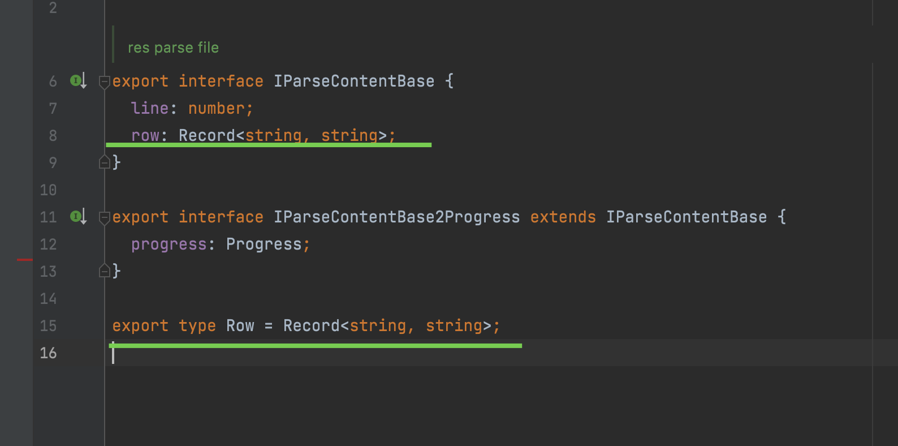  


### Interface helps me done right!

  


### Interface 和 Object 之间的关系

如图，在我花了漫长的时间终于设计出一个目前接口比较良好的`handleParseFile`的函数之后，为了暴露给前端，我需要写一个接口。

  

这个时候，问题来了，我当然可以直接用`ReturnType`自动追踪这个函数的参数与返回类型……

OH NO！

写着写着我发现我想错了，我虽然可以从函数自动得到它的返回类型，但我貌似是没法得到这个函数的参数类型的吧（待确定）！

你看，写笔记还是有帮助的，不写还不知道自己的认知其实是错的呢！

这就先去查一查，是否可以将接口自动同步于某个函数，或者说，是否可以从函数生成接口。

  


确实不行！都没有相关问题！

老老实实写接口吧！（原以为是先有鸡再有蛋的问题呢！结果ts直接把“蛋生鸡”路给封了！）

  


### Error类的继承设计

很有意思的一点，就是在整合优化代码时，发现整合到了Error类的冗余定义。

再仔细想想`eslint`对每个文件只能有一个`class`导出的约定，还挺有意思的，把类拆开，代码变得更加好组织了。

  

所以接下来就是把所有用这个类的代码都消掉了。

  

OK，很快就消除完了，毕竟我后续定义的`MyError`类是这个`TestCsv...`类的超集。

  

## Experience
### Do not use global electron
These days, 

### I can only use Sqlite3 for one connection
Developers of `prisma` are devoted to work, and I learned a lot from their github issue.

And I am surprised to find that I can only use one connection limit in order not to cause timeout.

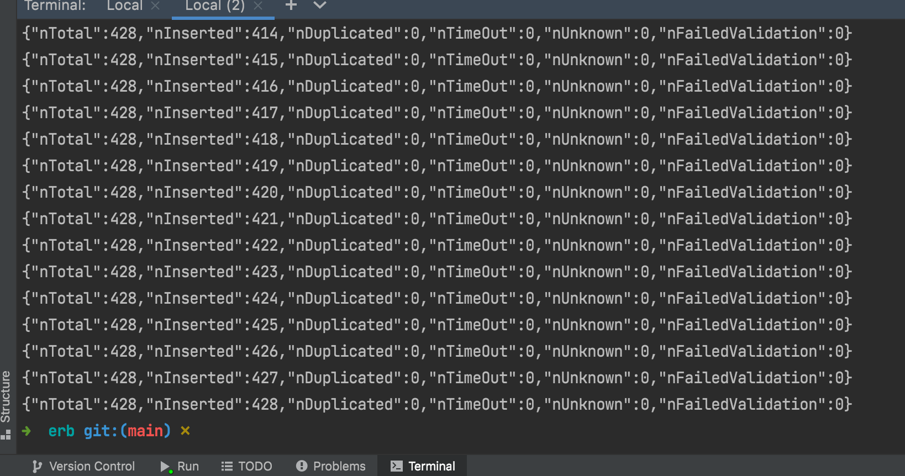  

ref:
- [Support setting a timeout for SQLite · Issue #2955 · prisma/prisma](https://github.com/prisma/prisma/issues/2955)


## [ARCHIVE] deploy script
This section is done in the primary era of this project, and the solution is based on web, which is proved to be not suitable later (but valuable for reuse).

Now the project is fully based on `Electron + React + TypeScript + Sqlite3` (a minor local database).

### deploy backend (python, fastapi)

suppose you have deployed project onto the server under directory `hjxh_express_match/backend/`, the backend structure may be:
```text
.
├── config.py
├── const.py
├── db.py
├── hash.py
├── log.py
├── logs
├── main.py
├── requirements.txt
├── static
├── templates
```

the `requirements.txt` includes all the dependencies need by the python interpreter of this project.

We should first create a new environment on this server, for pure use of this project, i.e:
1. install the python on the server, the version of which would better correspond with the one of the local in case of unexpected error caused by version difference
2. use `virtualenv` to create an env based on this python version named `venv_py` under this working directory
3. activate this env
4. use `pip` to install the `requirements.txt`
5. run! 

```bash
PY_VERSION=python3.8

# install the target python version based on its version number
# if you don't use these two lines, then you would suffer from `wget blablabla...` when you checked what the hell the python repo url is 
sudo apt install software-properties-common -y
sudo add-apt-repository ppa:deadsnakes/ppa
sudo apt install ${PY_VERSION}

# use `virtualenv` to create and activate a new python env fast~
sudo apt install virtualenv
virtualenv -p ${PY_VERSION} venv_py
source venv_py/bin/activate

# install all the requirements
# if you need to dump all the requirements of a python project used, you can use `pip freeze > requirements.txt` so that a file named of `requirements.txt` would be generated under the current directory
pip install -r requirements.txt

# run our backend of `fastapi`
python main.py
```


### deploy frontend (node, react)

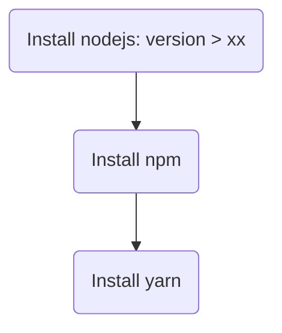
```mermaid
graph TD;

	 nodejs(Install nodejs: version > xx);
	 npm(Install npm);
	 yarn(Install yarn);

	 nodejs-->npm-->yarn;
```

1. install nodejs
2. install npm
3. install yarn: `sudo npm install -g yarn`

reference:
- [mermaid - Markdownish syntax for generating flowcharts, sequence diagrams, class diagrams, gantt charts and git graphs.](https://mermaid-js.github.io/mermaid/#/./flowchart?id=flowcharts-basic-syntax)


## [ARCHIVE] 表约定【重要】

该章节的全部内容均已经更新，并且独立成单独的文件，方便用于前端展示，已不在总文档内更新，具体可以见：
- [upload_base](./erb/src/docs/upload_base.md)
- [upload_erp](./erb/src/docs/upload_erp.md)
- [upload_trd](./erb/src/docs/upload_trd.md)

### 术语定义
- erp表：erp数据由erp系统导出，以`.csv`文件形式，内部只会有一张表，该文件即该表即erp表即erp的明细表
- trd表：trd数据由各物流公司给出，以`.xlsx|.xls`文件形式，内部可能会有多张表，其中包含物流明细信息的表叫明细表，该明细表即trd表

### 通用表约定
对于任意一张明细表，尽管即使表的内容存在一定的不规范也不影响解析，但总体来说，表的质量也有优劣之分，以下将给出详细的参照，在系统读表的过程中如果出现问题可以对照该参照，一定程度上可以找到问题的所在。
1. 明细表的第一行，**必须**是列字段，不得出现第一行为空、为非相关信息等，否则将出错
2. 明细表的数据主体**必须**是一个完整的矩形，即列与列之间不得空列、行与行之间不得有空行，否则将导致数据解析丢失
3. 明细表的数据主体之后，允许有多余的其他汇总信息，但是，这可能导致最终解析错误，建议不要加汇总信息，或者至少隔一行。如果您们使用excle自带的统计汇总功能，请剪切最后一行然后粘贴到`第N+2行`或以后；如果直接用右键插入一行空行，实际上程序依旧会把它们识别成一起，最终导致错误。
4. 基于以上格式规范的表，是一张较为完美的表。

### erp表约定
1. erp表**必须**以`.csv`格式导出，并且加上`erp_`前缀，否则无法解析
2. erp表中**必须**包含以下列字段：
	1. 物流单号 --> _id
	2. 收货地区 --> area_erp
	3. 实际重量 --> weight_erp
	4. 发货时间 --> time_erp
	5. 物流公司 --> logistics_erp

### trd表约定
1. trd表**必须**以`.xlsx | .xls`格式导出，并且加上`trd_`前缀，否则无法解析
2. trd表中**必须**有一张明细表，该明细表必须有`_明细`前缀，用于程序识别
3. trd的明细表**必须**新建一列`_快递`，用于标识所选用的快递公司，快递公司的名字要使用该表对应的价格表中的公司抬头名，比如"铁岭中通"或者"常州韵达"
4. 目前对trd表的列字段没有像erp那样严格，我们目前的算法是循环检测是否包含目标字段，这将有误判概率，例如表中同时有"实收重量"与"重量"两列，就很可能识别成"重量"而非"实收重量"，基于这些已有的问题，trd表中的列字段仍需做出一定的约束，目标表的列字段的实际命名，**必须**是列表中的合法元素，否则将产生错误；如果有多个元素，则目标列必须在伪目标列之前，否则将产生错误（或可定制）。一个比较稳妥的做法，就是统一使用第一个候选列名，虽然这个代价应该有点大。
	 1. 快递单号： ("快递单号", "运单编号", "运单号", "运单", "单号") --> _id
	 2. 省份： ("省份", "省", "目的", "收货", "到达") --> area_trd
	 3. 重量： ("重量", ) --> weight_trd
	 4. 发货时间： ("发货时间", "发货日期", "时间", "日期") --> time_trd
	 5. 运费： ("运费", "快递费", "面单费", "费用", "总价",  "金额", "价格",) --> fee_trd

### 列字段约束
1. 快递单号 (_id)
	1. 快递单号**不得为空**
	2. 快递单号**必须**是文本，在实际操作中发现有存为数据格式，导致被excel误以为是一个大整数于是丢失了尾部的0的情况，请务必以文本形式存储，否则将全部报错
	3. 快递单号还发现有"=xxxx"格式存储的，可能是用了公式啥的，尽管已经设计了算法还原，但是尽量避免这样的问题产生
	4. 否则该行报错
2. 重量 (weight_erp, weight_trd)
	1. 所有重量**不得为空**
	2. 所有重量**必须**是一个浮点数（小数或整数）
	3. 所有重量**必须**大于0
	4. 否则该行报错
3. 省份（area_erp, area_trd)
	1. 所有省份**不得为空**
	2. 所有省份**必须**以合法的34个省市自治区的前缀开头
	3. 否则该行报错
4. 发货时间 (time_erp, time_trd)
	1. 所有时间**不得为空**
	2. 所有时间**必须**包含"YYYY.MM.DD"或"MM.DD.YYYY"字符串样式，其中"."可以是"-"或者"/"
	3. 实际解析过程中发现还有以1900年起的天数作为日期列的，即4w+的一个数，尽管我已经写了一个逆转算法，但是尽量避免这样的问题产生，这里面涉及到excel中短日期的显示问题，具体可以查一下相关资料
	4. 否则该行报错
