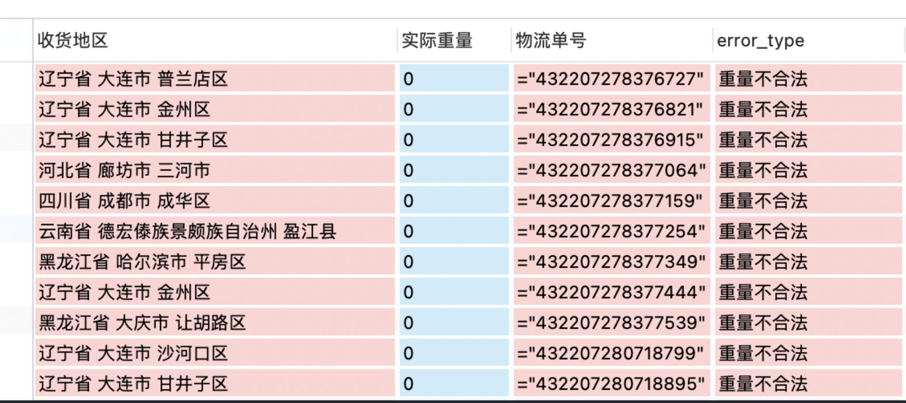

# 皇家小虎快递匹配系统

## Todo
- [x] 使用ODM进行数据管理【立即！】
- [ ] 支持上传的文件的 Sample 备份预览【包含head与tail五行】

## Problems
### 第三方表匹配不上ERP表
- [ ] 重要，待解决

### ERP表中，计算价格错误
目前已发现的主要有两种错误：
1. 收货地区填写不规范（6/50+w），导致未能正确识别省份名称，例如：
  

2. 重量为0（这个还比较多，146/50+w），无法理解,例如：
  

## Questions
### 第三方报表格式
- [ ] 注意到发来的第三方对账单，例如：“11月第三方仓韵达”是Excel格式，且包含着“订单明细wms”表与“快递核算标准”表，请问这个应该属于“惯例”吧？
anyway，这个倒不是啥问题哈，个人可以接受。

### 第三方表字段含义
  

1. 发货订单号 和 快递单号 之间的区别？该选用哪个？
2. 涨价金额 是什么，是不是无关紧要？

##  设计
### 数据库的表设计

数据库的设计里，我初步是想基于“年-月”设计表的，但这样的话，对于用户上传的表，就要逐一进行时间提取并标记然后分类，效率势必非常之慢，所以不可行。

为了支持用户高速批量导入，应该将用户所提交的表视为无状态的表，比较合适的是，按照快递公司进行分类导入，不过这对用户可能不太友好，毕竟有30多家公司……

那回到之前的方案，如果是按月导入，程序不去核对月份，而按照用户对表的约定进行数据库分类，这样是否可行呢？也许这是一个不错的方案，但这对用户的要求太高了，目前用户导出的erp表的表名与内容还有对不上的，比如ljx导的表名是12月14日的表，但里面的内容其实是11月份的，这让程序或者用户进行表主体月份划定，就存在较大的误判可能。

如果什么都不做呢？直接塞表，不去计算月份，也不按月份进行表划分，也不按快递公司进行表划分，这样的话最大的问题就是表的体积越来越大，后续匹配的速度可能就会越来越慢了。毕竟也没人可以与愿意对后续的表进行维护与调优。

综合考虑的话，那还是在数据插入时，程序计算，然后自动分类到按月划分的表里，这样插入虽然慢一些，但是好歹匹配起来会比较快，而且也不太需要考虑后续维护的问题，毕竟每个月的数据量再怎么样也是可以接受的，后续匹配的效率也可以得到保障。

