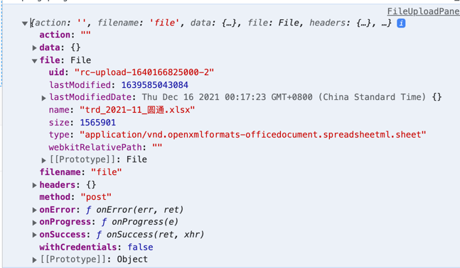
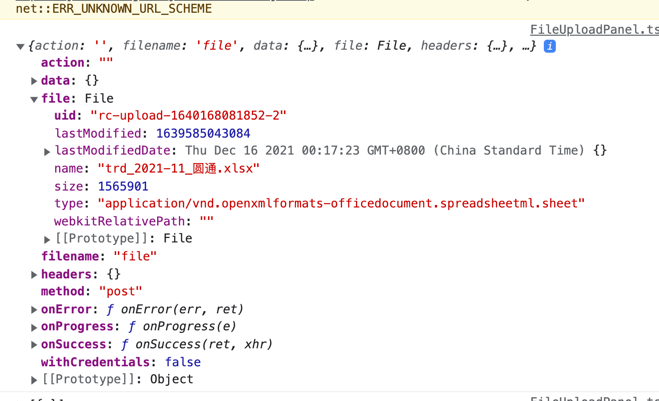
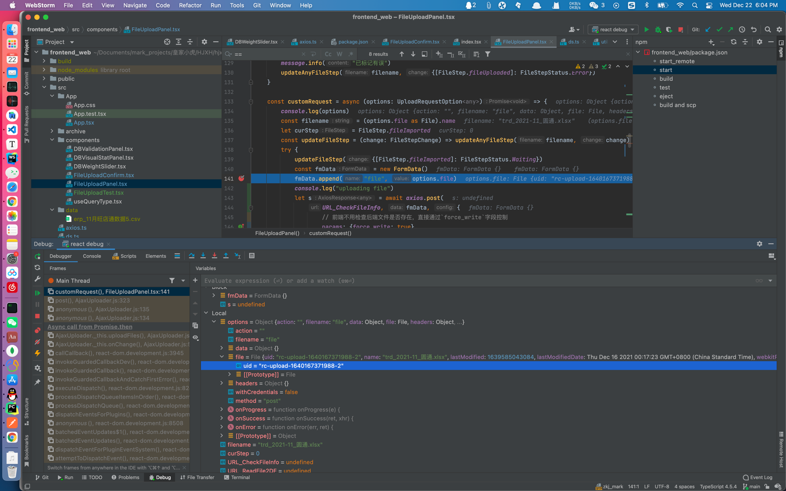
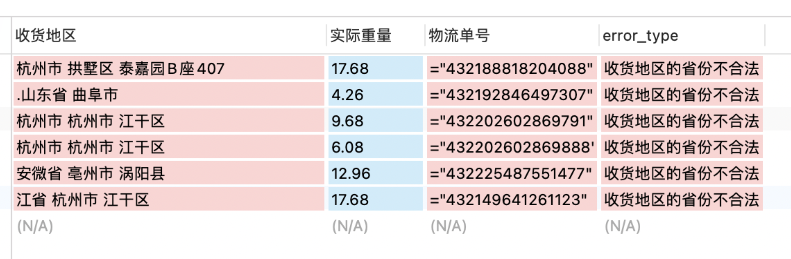
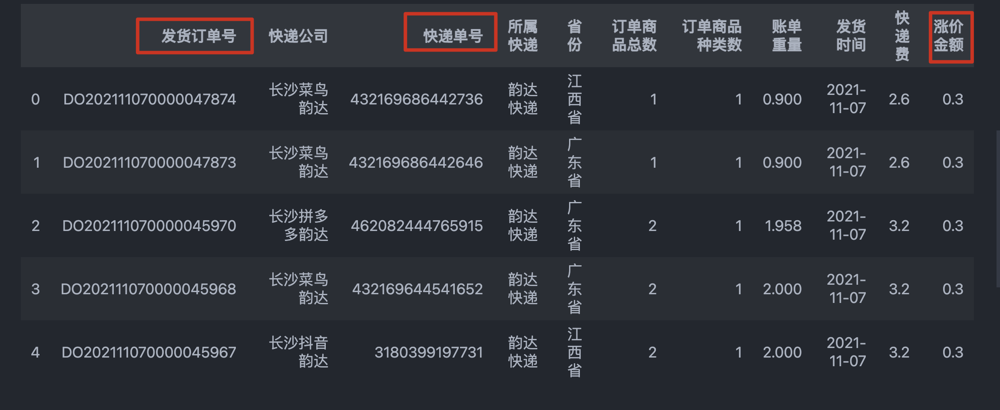
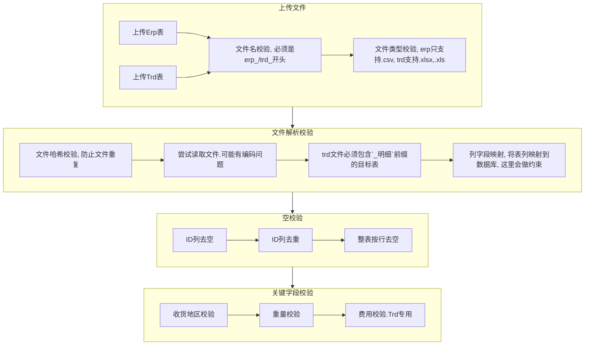
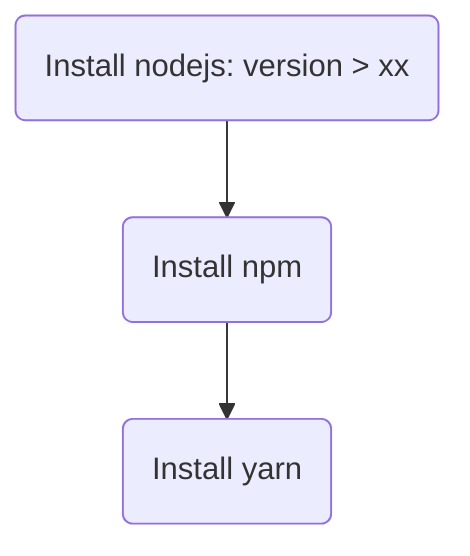

# `hjxh_express_match` 皇家小虎快递匹配系统

1. [Agenda](#agenda)
	1. [Todo](#todo)
	2. [Finished](#finished)
2. [BugFix](#bugfix)
	1. [- [ ] 解析数据有误问题：](#----解析数据有误问题)
	2. [- [ ] `sqlite3、typeorm` native dependency](#----sqlite3typeorm-native-dependency)
	3. [- [x] `progress-stream` cause bug](#--x-progress-stream-cause-bug)
	4. [`try...catch...finally` problem](#trycatchfinally-problem)
	5. [- [x] ipcRenderer duplicate response](#--x-ipcrenderer-duplicate-response)
	6. [- [x] how to async and partially read csv](#--x-how-to-async-and-partially-read-csv)
	7. [- [x] which to choose: `node-csv` or `fast-csv`](#--x-which-to-choose-node-csv-or-fast-csv)
	8. [- [x] axios `form-data` parse bug](#--x-axios-form-data-parse-bug)
3. [业务问题](#业务问题)
	1. [[x] ERP表中，计算价格错误](#x-erp表中计算价格错误)
	2. [[x] 第三方表匹配不上ERP表](#x-第三方表匹配不上erp表)
	3. [[x] 第三方报表格式](#x-第三方报表格式)
	4. [[x] 第三方表字段含义](#x-第三方表字段含义)
4. [设计](#设计)
	1. [工作流设计](#工作流设计)
	2. [数据库的选择](#数据库的选择)
	3. [数据库的表设计](#数据库的表设计)
	4. [[DEPRECIATED] Module Design](#depreciated-module-design)
5. [[ARCHIVE] deploy script](#archive-deploy-script)
	1. [deploy backend (python, fastapi)](#deploy-backend-python-fastapi)
	2. [deploy frontend (node, react)](#deploy-frontend-node-react)
6. [[ARCHIVE] 表约定【重要】](#archive-表约定重要)
	1. [术语定义](#术语定义)
	2. [通用表约定](#通用表约定)
	3. [erp表约定](#erp表约定)
	4. [trd表约定](#trd表约定)
	5. [列字段约束](#列字段约束)


## Agenda
### Todo
- [ ] 正在做：使用数据库+ODM进行数据存储管理

### Finished
- [x] 支持上传的文件的 Sample 备份预览（包含head与tail五行）。这是之前的方案，目前已经不采用，目前不存在0/1的问题，即不是按文件为基本单位传输给用户，而是在读取过程中持续地按行为基本单位（可选：筛选出有问题的部分）传输给用户，因此备份预览没有意义也不需要了。
- [x] 完成数据库、前端、后端的基本设计。2021年12月22日


## BugFix
### - [ ] 解析数据有误问题：
  

### - [ ] `sqlite3、typeorm` native dependency

安装`sqlite3, typeorm`之后没法运行`electron`了
  
- [What is exactly native dependency? · Issue #1042 · electron-react-boilerplate/electron-react-boilerplate](https://github.com/electron-react-boilerplate/electron-react-boilerplate/issues/1042)

### - [x] `progress-stream` cause bug

2021年12月29日04:47:04，在引入`progress-stream`包后导致了`csv`解析的错误，后来测试发现，只要把`progress-stream`放在`fast-csv`之前就行了。想来也是，毕竟`progress-stream`是处理`stream`的，而`csv`那一步已经变成`row`了，具体细节我也不明白也不是很重要，这里会用就行了。
  
- [freeall/progress-stream: Read the progress of a stream](https://github.com/freeall/progress-stream)
- [progress-stream - npm](https://www.npmjs.com/package/progress-stream)
- [node.js - streams with percentage complete - Stack Overflow](https://stackoverflow.com/questions/17798047/streams-with-percentage-complete)

### `try...catch...finally` problem

- [x] 2021年12月29日03:40:04，`try...catch`结构中，`finally`为什么会提前结束？事实上这个问题是我对js中的`try...catch...finally`理解不够深刻，还拿着`python`中的同步思维去理解的。js里的这套结构体远比我想象地复杂，但是呢，为了避免这种复杂（在`try`或者`catch`中各种乱返回），一种好的办法就是只在`finally`里返回（当然，这点我是知道的，只不过没有把它当做信仰）。具体可以见这些：
- [Finally in Promises & Try/Catch - DEV Community](https://dev.to/annarankin/finally-in-promises--trycatch-2c44)
- [javascript - Why does a return in `finally` override `try`? - Stack Overflow](https://stackoverflow.com/questions/3837994/why-does-a-return-in-finally-override-try)

### - [x] ipcRenderer duplicate response

2021年12月29日01:03:02，ipc通信中前端逐步累积渲染问题，猜测原因，可能是1. `ipcRenderer`中的端口使用`on`导致重复监听，并且最后的`removeAllListeners`方法没有生效；2.`react`问题。貌似重新启动一下`electron`就好了……
  
现在已经能够正常地控制`channel`的监听与关闭了，不过一个新的，也是真正的问题确实发现了：js中的`finally`与`try...catch`之间，有点微妙的关系，因为的`finally`运行的比`try...catch`要早，导致`channel`提前被关了（预期应该是数据传完之后（也就是`try`完后）才关闭）。

### - [x] how to async and partially read csv
csv异步、小量快读读取.csv文件头部信息，以确定编码。已实现，基于`fast-csv`解决了中文乱码导致`node-csv`无法读取的问题，同时基于`iconv`实现了`gbk`与`utf-8`之间的无缝转换

### - [x] which to choose: `node-csv` or `fast-csv`

csv文件读取的选型与方法。经过鉴定，`node-csv`的接口比较低级，`fast-csv`更高些，并且更加稳健，输出方式（可以设置headers有或者无）比较友好，所以选择`fast-csv`。在读取上，有`fs.read`，`fs.readFile`，`fs.createReadStream`等几种方式，经过比较，`fs.read`接口比较低级，速度快，适合用于编码测试；等测试完后使用`fs.createReadStream`处理流数据比较好，方便与`iconv`、`fast-csv`等配合。

### - [x] axios `form-data` parse bug
本地前端上传文件`options`信息：

远程前端上传文件`options`信息：

这是在前端进行文件上传的断点调试

基于这个，再进行服务端文件调试，比对文件信息的不同。但是现在的问题是服务端进入不了程序逻辑，直接被fastapi拒绝了。


## 业务问题

### [x] ERP表中，计算价格错误
目前已发现的主要有两种错误：
1. 收货地区填写不规范（6/50+w），导致未能正确识别省份名称，例如：


更新：对于这种问题，直接提示报错即可。

2. 重量为0（这个还比较多，146/50+w），无法理解,例如：
  

更新：对于这个问题，一开始是某张表给的问题，后续小范围问题可以直接报错提示。


### [x] 第三方表匹配不上ERP表
更新：初期是因为发现有很多表的id导出是`=`开头的，后期加了稳健的检测与转换，这个问题就基本没了。

### [x] 第三方报表格式
注意到发来的第三方对账单，例如："11月第三方仓韵达"是Excel格式，且包含着"订单明细wms"表与"快递核算标准"表，请问这个应该属于"惯例"吧？
anyway，这个倒不是啥问题哈，个人可以接受。

更新：这个问题其实不重要，因为有一个专门的快递核算大表，可以根据那个进行运费计算。


### [x] 第三方表字段含义
  

1. 发货订单号 和 快递单号 之间的区别？该选用哪个？
2. 涨价金额 是不是无关紧要？

更新：目前直接规定死字段。


## 设计

### 工作流设计




### 数据库的选择

对数据库选择的倾向：mongodb --> mysql --> sqlite3

【2021年12月28日】我是觉得，应该用`sqlite3`，也是今天才意识到的。
  
ref:
- [javascript - Electron app with database - Stack Overflow](https://stackoverflow.com/questions/51119248/electron-app-with-database/51119689)


### 数据库的表设计

数据库的设计里，我初步是想基于"年-月"设计表的，但这样的话，对于用户上传的表，就要逐一进行时间提取并标记然后分类，效率势必非常之慢，所以不可行。

为了支持用户高速批量导入，应该将用户所提交的表视为无状态的表，比较合适的是，按照快递公司进行分类导入，不过这对用户可能不太友好，毕竟有30多家公司……

那回到之前的方案，如果是按月导入，程序不去核对月份，而按照用户对表的约定进行数据库分类，这样是否可行呢？也许这是一个不错的方案，但这对用户的要求太高了，目前用户导出的erp表的表名与内容还有对不上的，比如ljx导的表名是12月14日的表，但里面的内容其实是11月份的，这让程序或者用户进行表主体月份划定，就存在较大的误判可能。

如果什么都不做呢？直接塞表，不去计算月份，也不按月份进行表划分，也不按快递公司进行表划分，这样的话最大的问题就是表的体积越来越大，后续匹配的速度可能就会越来越慢了。毕竟也没人可以与愿意对后续的表进行维护与调优。

综合考虑的话，那还是在数据插入时，程序计算，然后自动分类到按月划分的表里，这样插入虽然慢一些，但是好歹匹配起来会比较快，而且也不太需要考虑后续维护的问题，毕竟每个月的数据量再怎么样也是可以接受的，后续匹配的效率也可以得到保障。


### [DEPRECIATED] Module Design
- Import Panel
- Analysis Panel
- ReviseInAnalysis Panel
- Upload Panel
- Comparison Panel
- Database Panel
- Feedback Panel

## [ARCHIVE] deploy script
This section is done in the primary era of this project, and the solution is based on web, which is proved to be not suitable later (but valuable for reuse).

Now the project is fully based on `Electron + React + TypeScript + Sqlite3` (a minor local database).

### deploy backend (python, fastapi)

suppose you have deployed project onto the server under directory `hjxh_express_match/backend/`, the backend structure may be:
```text
.
├── config.py
├── const.py
├── db.py
├── hash.py
├── log.py
├── logs
├── main.py
├── requirements.txt
├── static
├── templates
```

the `requirements.txt` includes all the dependencies need by the python interpreter of this project.

We should first create a new environment on this server, for pure use of this project, i.e:
1. install the python on the server, the version of which would better correspond with the one of the local in case of unexpected error caused by version difference
2. use `virtualenv` to create an env based on this python version named `venv_py` under this working directory
3. activate this env
4. use `pip` to install the `requirements.txt`
5. run! 

```bash
PY_VERSION=python3.8

# install the target python version based on its version number
# if you don't use these two lines, then you would suffer from `wget blablabla...` when you checked what the hell the python repo url is 
sudo apt install software-properties-common -y
sudo add-apt-repository ppa:deadsnakes/ppa
sudo apt install ${PY_VERSION}

# use `virtualenv` to create and activate a new python env fast~
sudo apt install virtualenv
virtualenv -p ${PY_VERSION} venv_py
source venv_py/bin/activate

# install all the requirements
# if you need to dump all the requirements of a python project used, you can use `pip freeze > requirements.txt` so that a file named of `requirements.txt` would be generated under the current directory
pip install -r requirements.txt

# run our backend of `fastapi`
python main.py
```


### deploy frontend (node, react)



1. install nodejs
2. install npm
3. install yarn: `sudo npm install -g yarn`

reference:
- [mermaid - Markdownish syntax for generating flowcharts, sequence diagrams, class diagrams, gantt charts and git graphs.](https://mermaid-js.github.io/mermaid/#/./flowchart?id=flowcharts-basic-syntax)


## [ARCHIVE] 表约定【重要】

该章节的全部内容均已经更新，并且独立成单独的文件，方便用于前端展示，已不在总文档内更新，具体可以见：
- [upload_base](./erb/src/docs/upload_base.md)
- [upload_erp](./erb/src/docs/upload_erp.md)
- [upload_trd](./erb/src/docs/upload_trd.md)

### 术语定义
- erp表：erp数据由erp系统导出，以`.csv`文件形式，内部只会有一张表，该文件即该表即erp表即erp的明细表
- trd表：trd数据由各物流公司给出，以`.xlsx|.xls`文件形式，内部可能会有多张表，其中包含物流明细信息的表叫明细表，该明细表即trd表

### 通用表约定
对于任意一张明细表，尽管即使表的内容存在一定的不规范也不影响解析，但总体来说，表的质量也有优劣之分，以下将给出详细的参照，在系统读表的过程中如果出现问题可以对照该参照，一定程度上可以找到问题的所在。
1. 明细表的第一行，**必须**是列字段，不得出现第一行为空、为非相关信息等，否则将出错
2. 明细表的数据主体**必须**是一个完整的矩形，即列与列之间不得空列、行与行之间不得有空行，否则将导致数据解析丢失
3. 明细表的数据主体之后，允许有多余的其他汇总信息，但是，这可能导致最终解析错误，建议不要加汇总信息，或者至少隔一行。如果您们使用excle自带的统计汇总功能，请剪切最后一行然后粘贴到`第N+2行`或以后；如果直接用右键插入一行空行，实际上程序依旧会把它们识别成一起，最终导致错误。
4. 基于以上格式规范的表，是一张较为完美的表。

### erp表约定
1. erp表**必须**以`.csv`格式导出，并且加上`erp_`前缀，否则无法解析
2. erp表中**必须**包含以下列字段：
	1. 物流单号 --> _id
	2. 收货地区 --> area_erp
	3. 实际重量 --> weight_erp
	4. 发货时间 --> time_erp
	5. 物流公司 --> logistics_erp

### trd表约定
1. trd表**必须**以`.xlsx | .xls`格式导出，并且加上`trd_`前缀，否则无法解析
2. trd表中**必须**有一张明细表，该明细表必须有`_明细`前缀，用于程序识别
3. trd的明细表**必须**新建一列`_快递`，用于标识所选用的快递公司，快递公司的名字要使用该表对应的价格表中的公司抬头名，比如"铁岭中通"或者"常州韵达"
4. 目前对trd表的列字段没有像erp那样严格，我们目前的算法是循环检测是否包含目标字段，这将有误判概率，例如表中同时有"实收重量"与"重量"两列，就很可能识别成"重量"而非"实收重量"，基于这些已有的问题，trd表中的列字段仍需做出一定的约束，目标表的列字段的实际命名，**必须**是列表中的合法元素，否则将产生错误；如果有多个元素，则目标列必须在伪目标列之前，否则将产生错误（或可定制）。一个比较稳妥的做法，就是统一使用第一个候选列名，虽然这个代价应该有点大。
	 1. 快递单号： ("快递单号", "运单编号", "运单号", "运单", "单号") --> _id
	 2. 省份： ("省份", "省", "目的", "收货", "到达") --> area_trd
	 3. 重量： ("重量", ) --> weight_trd
	 4. 发货时间： ("发货时间", "发货日期", "时间", "日期") --> time_trd
	 5. 运费： ("运费", "快递费", "面单费", "费用", "总价",  "金额", "价格",) --> fee_trd

### 列字段约束
1. 快递单号 (_id)
	1. 快递单号**不得为空**
	2. 快递单号**必须**是文本，在实际操作中发现有存为数据格式，导致被excel误以为是一个大整数于是丢失了尾部的0的情况，请务必以文本形式存储，否则将全部报错
	3. 快递单号还发现有"=xxxx"格式存储的，可能是用了公式啥的，尽管已经设计了算法还原，但是尽量避免这样的问题产生
	4. 否则该行报错
2. 重量 (weight_erp, weight_trd)
	1. 所有重量**不得为空**
	2. 所有重量**必须**是一个浮点数（小数或整数）
	3. 所有重量**必须**大于0
	4. 否则该行报错
3. 省份（area_erp, area_trd)
	1. 所有省份**不得为空**
	2. 所有省份**必须**以合法的34个省市自治区的前缀开头
	3. 否则该行报错
4. 发货时间 (time_erp, time_trd)
	1. 所有时间**不得为空**
	2. 所有时间**必须**包含"YYYY.MM.DD"或"MM.DD.YYYY"字符串样式，其中"."可以是"-"或者"/"
	3. 实际解析过程中发现还有以1900年起的天数作为日期列的，即4w+的一个数，尽管我已经写了一个逆转算法，但是尽量避免这样的问题产生，这里面涉及到excel中短日期的显示问题，具体可以查一下相关资料
	4. 否则该行报错