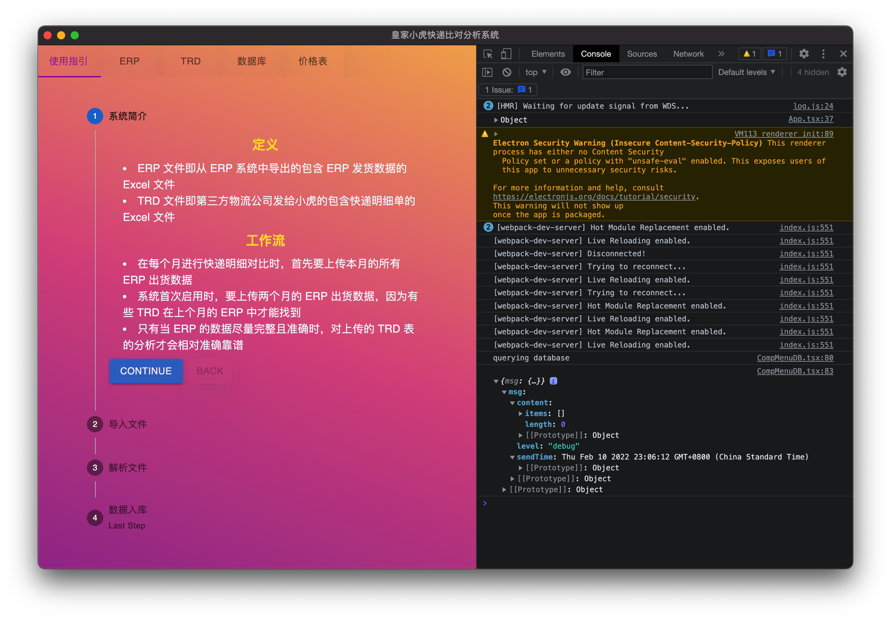
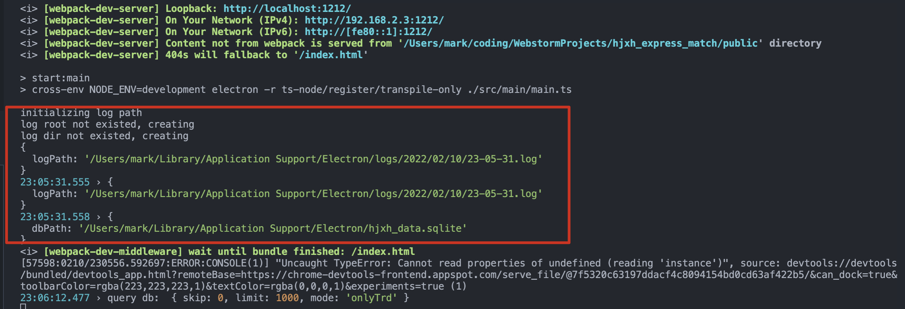
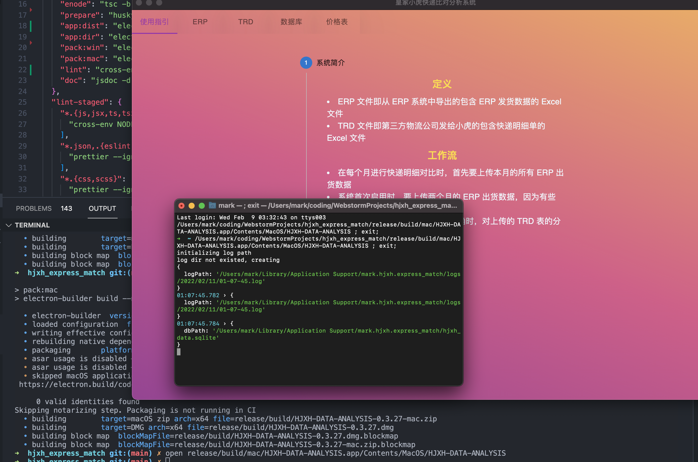
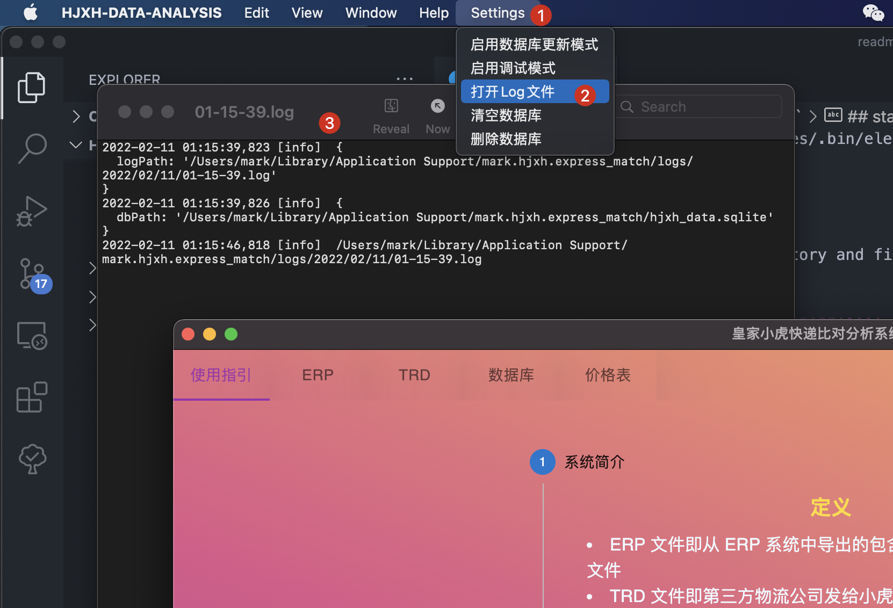

# `hjxh_express_match`

1. [overview](#overview)
2. [init](#init)
3. [start app](#start-app)
4. [pack app for mac](#pack-app-for-mac)
5. [pack app for windows](#pack-app-for-windows)
6. [open app on mac](#open-app-on-mac)
    1. [1. using `open` command with console](#1-using-open-command-with-console)
    2. [2. directly open](#2-directly-open)
7. [check log](#check-log)
8. [scripts](#scripts)

## overview

the gui of menu-guidance:

  

## init

```sh
git clone https://github.com/hjxh-opendata/hjxh-express-match-gui hjxh-express-match
cd hjxh-express-match
npm i
```

## start app

```sh
# dev
npm run start

# prop
npm run build && ./node_modules/.bin/electron release/app

# binary
```

It will auto create log directory and files under the application path when you first run this project (or later deleted them manually).

  

the app root is:

- dev: `~/Library/Application Support/Electron`
- prod: `~/Library/Application Support/mark.hjxh.express_match`
- binary: `~/Library/Application Support/mark.hjxh.express_match`

the log dir is `$ROOT/logs`

the database path is `$ROOT/hjxh_data.sqlite`

## pack app for mac

1. :warning: ensure electron-mirror variable is `https://cdn.npm.taobao.org/dist/electron/` (see: [Advanced Installation Instructions | Electron](https://www.electronjs.org/docs/latest/tutorial/installation#mirror)) in env (`ELECTRON_MIRROR`) or `.npmrc | ~/.npmrc` (`electron_mirror`) or `build/electron-mirror` in `package.json`.
2. rebuild app, and pack mac/win

```sh
export ELECTRON_MIRROR=https://cdn.npm.taobao.org/dist/electron/
npm run app:dist
npm run pack:mac
```

## pack app for windows

It almost cost me 2-3 hours to get to realize:

- no need to install `node-gpy` and `node-pre-gpy`
- no need to set go proxy via `GOPROXY`

The only thing we need is to rebuild the native dependencies of `sqlite3`. 

```sh
npm run rebuild sqlite3
```

And then pack:

```sh
npm run pack:win
```

## open app on mac

### 1. using `open` command with console

```sh
open release/build/mac/HJXH-DATA-ANALYSIS.app/Contents/MacOS/HJXH-DATA-ANALYSIS
```

  

### 2. directly open

```sh
open release/build/mac/HJXH-DATA-ANALYSIS.app
```

## check log

  

## scripts

```sh
# clear database (for dev)
npm run tnode scripts/script_clear_db.ts $DB_FILE_PATH
```
