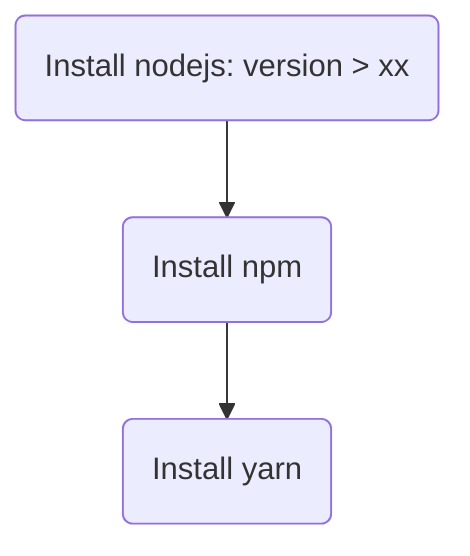

## [ARCHIVE] deploy script

This section is done in the primary era of this project, and the solution is based on web, which is proved to be not
suitable later (but valuable for reuse).

Now the project is fully based on `Electron + React + TypeScript + Sqlite3` (a minor local database).

### deploy backend (python, fastapi)

suppose you have deployed project onto the server under directory `hjxh_express_match/backend/`, the backend structure
may be:

```text
.
├── config.py
├── const.py
├── db.py
├── hash.py
├── log.py
├── logs
├── main.py
├── requirements.txt
├── static
├── templates
```

the `requirements.txt` includes all the dependencies need by the python interpreter of this project.

We should first create a new environment on this server, for pure use of this project, i.e:

1. install the python on the server, the version of which would better correspond with the one of the local in case of
   unexpected error caused by version difference
2. use `virtualenv` to create an env based on this python version named `venv_py` under this working directory
3. activate this env
4. use `pip` to install the `requirements.txt`
5. run!

```bash
PY_VERSION=python3.8

# install the target python version based on its version number
# if you don't use these two lines, then you would suffer from `wget blablabla...` when you checked what the hell the python repo url is 
sudo apt install software-properties-common -y
sudo add-apt-repository ppa:deadsnakes/ppa
sudo apt install ${PY_VERSION}

# use `virtualenv` to create and activate a new python env fast~
sudo apt install virtualenv
virtualenv -p ${PY_VERSION} venv_py
source venv_py/bin/activate

# install all the requirements
# if you need to dump all the requirements of a python project used, you can use `pip freeze > requirements.txt` so that a file named of `requirements.txt` would be generated under the current directory
pip install -r requirements.txt

# run our backend of `fastapi`
python main.py
```

### deploy frontend (node, react)



1. install nodejs
2. install npm
3. install yarn: `sudo npm install -g yarn`

reference:

- [mermaid - Markdownish syntax for generating flowcharts, sequence diagrams, class diagrams, gantt charts and git graphs.](https://mermaid-js.github.io/mermaid/#/./flowchart?id=flowcharts-basic-syntax)
